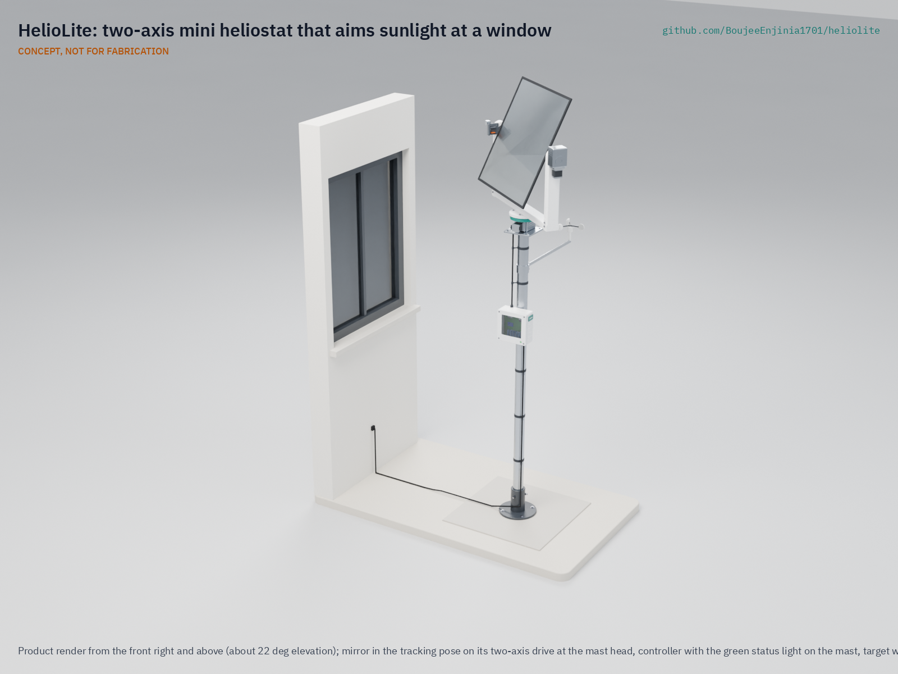
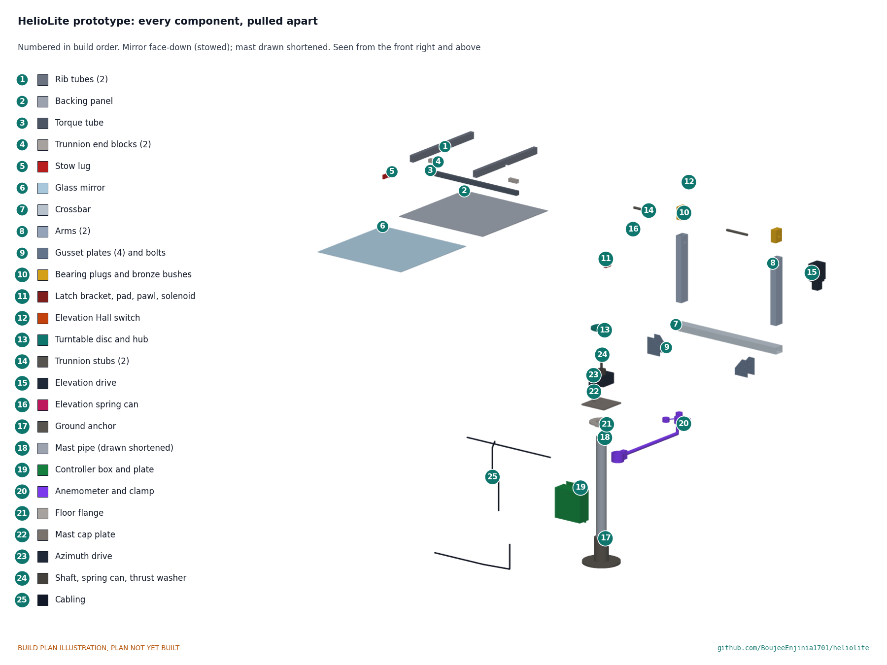

# HelioLite

     

**Area:** CleanTech · **TRL:** 3 of 9 (proof of concept on paper) · **Value-engineering target:** about $455 USD · **Difficulty:** 3 of 5

Two-axis mini heliostat on a mast that redirects sunlight to a fixed target, using a sun-position algorithm with no sun sensors.

[Exploded render](media/render-exploded.png) · [Detail render](media/render-detail.png) · [Interactive 3D model](media/viewer.html) · [Concept blueprint (PDF)](media/concept-blueprint.pdf) · [General arrangement HLT-DWG-001 (PDF)](cad/drawings/HLT-DWG-001.pdf) · [Sizing calculations](docs/04-calcs/01-sizing.md) · [Prototype build plan](docs/05-build-plan.md) · [Design decisions register](docs/06-design-decisions.md) · [Review note](docs/REVIEW.md)

## Concept rationale

A flat mirror that follows the sun is the simplest way to move winter sunlight to where it is needed: it adds no light source, burns no fuel and uses a few watts to aim itself. Towns in deep valleys have proved the idea at civic scale ([NPR, 2013](https://www.npr.org/2013/11/03/242789411/as-mirrors-beam-light-to-town-norwegians-share-patch-of-sun)), and open microcontroller projects have shown that a clock and a sun-position algorithm can aim a mirror without a sun sensor ([jremington/Arduino_heliostat](https://github.com/jremington/Arduino_heliostat)). HelioLite joins the two at the scale of one window, with a mast, a light aluminum yoke and two worm drives instead of a structure on a mountainside.

Keeping the design open and garage-buildable matters because the useful sites are scattered and different: each yard, greenhouse or school has its own latitude, distances and shading, and the hourly model shows that siting changes the result more than any part choice. Common parts (a glazier's mirror, steel fence pipe, NEMA17 motors, an ESP32) let owners build, calibrate and repair a unit for their own site, and published calculations let them check that it will work there before they buy anything.

## Burning platform

People in the United States spend, on average, about 90 % of their time indoors ([US EPA](https://www.epa.gov/report-environment/indoor-air-quality)), so the daylight a room receives is most of the daylight its occupants get. Lighting in buildings and outdoor applications used about 8 % of global electricity in 2024, about 2,200 TWh ([IEA](https://www.iea.org/commentaries/the-next-wave-of-led-lighting-smarter-circular-and-more-efficient)), and rooms that never see the sun in winter are the ones that run lamps through the day.

Cold matters as well as dark. The WHO proposes 18 °C as a safe indoor temperature during cold seasons in temperate and colder climates ([WHO Housing and Health Guidelines, 2018](https://www.ncbi.nlm.nih.gov/books/NBK535281/table/fm-ch1.tab1/)), and north-facing rooms receive no passive solar gain toward it. HelioLite's contribution is modest, about 150 W while the sun shines, but it arrives at the time of day and in the rooms where winter sun is otherwise missing.

## Where it could be used

### By industry

| Industry | Use |
| --- | --- |
| Housing and home improvement | Daylight and a little heat in north-facing living rooms, kitchens and home offices |
| Horticulture and community gardens | Extra light on the shaded side of greenhouses, hoop houses and lean-tos in winter and spring |
| Education | A working teaching project in astronomy, optics and control for schools and makerspaces |
| Hospitality and small commercial | Sunlight into a north-facing courtyard, café seating or entrance on clear winter days |
| Urban planning and building retrofit | A small-scale option where new neighboring buildings take a dwelling's winter sun |

### By country or region

| Country or region | Why it matters there |
| --- | --- |
| United States | Space heating and air conditioning made up 52 % of household energy use in 2020, and homes in the colder Northeast and Midwest use more energy on average than those in the South and West, largely for heating ([US EIA](https://www.eia.gov/energyexplained/use-of-energy/homes.php)); houses, greenhouses and community gardens in the northern states have long, low-sun winters |
| European Union | In 2024, 9.2 % of the EU population could not keep their home adequately warm, rising to 19.0 % in Bulgaria and Greece ([Eurostat, 2026](https://ec.europa.eu/eurostat/web/products-eurostat-news/w/ddn-20260202-2)); in sunny southern member states, clear winter days make free solar gain worth capturing |
| China | Planning rules require dwellings to receive two or three hours of sunlight on Dahan Day (20 January) or one hour on the winter solstice, by climate zone and city size ([Hong, Wang and Zhang, *Buildings*, 2024](https://www.mdpi.com/2075-5309/14/4/1090)); units that fall short could borrow sun from a courtyard |
| Mongolia | More than half of Ulaanbaatar's residents, over 790,000 people, live in ger districts heated mainly by coal and wood, and January temperatures fall below -20 °C ([World Bank, 2018](https://www.worldbank.org/en/news/feature/2018/06/26/better-air-quality-in-ulaanbaatar-begins-in-ger-areas)); any daytime solar gain that does not come from a stove is worth having |
| Chile | Firewood produces as much as 94 % of fine particulate (PM2.5) emissions in some Chilean cities, and winter smog is trapped in valley cities such as Santiago ([UNEP](https://www.unep.org/news-and-stories/story/chile-takes-action-air-pollution)); in the Southern Hemisphere the rooms that miss winter sun face south |

## What sparked the idea

The starting point was Rjukan, a Norwegian town of about 3,500 people that the surrounding mountains keep out of direct sunlight from late September to mid-March. In 2013 a set of mirrors on the mountainside above the town was used for the first time: controlled by a computer, the mirrors shift with the sun through the day, pivot closed in windy weather and reflect a beam onto the central square, lighting an elliptical patch of about 600 m² ([NPR, 2013](https://www.npr.org/2013/11/03/242789411/as-mirrors-beam-light-to-town-norwegians-share-patch-of-sun)). HelioLite asks whether the same principle, a tracking mirror aimed by software, can serve a single dark room or greenhouse for a few hundred dollars in parts.

## Problem

North-facing rooms and greenhouses lack daylight and solar heat. On a clear winter day a 0.36 m² mirror can send about 160 W of sunlight (about 15,000 lm) through a window, enough to add roughly 500 lx to a small room, and 0.5 to 1.0 kWh a day at a well-sited house at 45° N, while its heat contribution is modest (calculations in [HLT-CAL-001](docs/04-calcs/01-sizing.md)).

## Concept

Two-axis mini heliostat on a mast that redirects sunlight to a fixed target, using a sun-position algorithm with no sun sensors.

An ESP32 computes the sun's position from a real-time clock and the site location every 30 s, and two worm-driven steppers turn the mirror so its normal bisects the directions to the sun and to the target. A phone-based calibration at four points over about 4 h fits the mount alignment, and spiral preload springs keep the worm drives' backlash out of the beam. The mirror stows face-down at night, before storms (from a cup anemometer and a wind forecast) and, on a supercapacitor reserve, after a power loss; a spring latch then carries the storm load instead of the gearbox.

At TRL 3 the paper checks meet 11 of 15 requirements with the design made constructable ([HLT-DDR-003](docs/decisions/0003-design-for-construction.md)). Value-engineering target: USD 455. Estimated cost of the constructable design: USD 492 (USD 37 over the target). Daily energy (R3) and pointing (R4) are at risk; see the [review note](docs/REVIEW.md).

Full design precis: [docs/02-concept.md](docs/02-concept.md)

## Key components

- Glass mirror 60 x 60 cm
- NEMA17 steppers on NMRV030-class 50:1 worm gearboxes (2)
- ESP32 with RTC
- Mast: 60.3 mm galvanized steel pipe (decided 2026-09-25)
- Aluminum tube yoke with printed bearing plugs and bronze bushes (made constructable 2026-10-01)
- Cup anemometer and supercapacitor stow reserve
- Stow stop and spring latch on the yoke, and spiral preload springs on both drives (decided 2026-09-25)

The priced bill of materials (USD 492 against the USD 455 value-engineering target, USD 37 over) is in [bom/bom.csv](bom/bom.csv). The parametric model is `cad/src/model.py`, with STEP and STL exports in `cad/step/` and `cad/stl/`.

## Building the prototype

The [prototype build plan](docs/05-build-plan.md) (HLT-BLD-001) shows how to make each of the 15 made components and how to put HelioLite together in 18 steps, with a making sketch for every made part, close-ups of the joints and a picture for every step, all drawn from the model. Building the plan made the design constructable: the printed yoke became an aluminum tube frame, and the trunnions, latch, mast top and fixings were detailed so every part can be made and fastened ([HLT-DDR-003](docs/decisions/0003-design-for-construction.md)). It is a plan, not yet built; building and testing to it is TRL 4 work. Decisions still open are in the [design decisions register](docs/06-design-decisions.md).

## Safety

> **Safety:** The reflected beam is nearly as bright as the sun and can cause eye injury; several mirrors aimed at one spot can start a fire. Never aim at people, vehicles or aircraft. The gimbal moves with high torque, the mirror is glass 2.2 m above the ground, and the mast must be anchored and stowed before storms. Only 12 V DC runs outdoors. See the safety section of the [precis](docs/02-concept.md).

## Repository layout

| Folder | Contents |
| --- | --- |
| `docs/` | Problem, concept, requirements, calculations and design decisions |
| `cad/src/` | build123d Python source, the source of truth for all geometry |
| `cad/step/`, `cad/stl/` | Exported models for FreeCAD, other CAD tools and printing |
| `cad/drawings/` | 2D sketches and dimensioned drawings |
| `bom/` | Bill of materials |
| `electronics/` | KiCad schematics and PCB layouts |
| `firmware/` | Microcontroller code |
| `media/` | Renders, perspectives and photos |
| `build-log/` | Dated prototyping notes |

## Documentation

Controlled documents follow the portfolio [documentation standard](.kit/STANDARDS.md). Each carries a document ID (HLT-PRC-001 for the precis), a version and a revision history. Branded PDFs are built with `python .kit/render.py` and attached to GitHub Releases when a document is tagged, for example `HLT-PRC-001/v1.0`.

## Credits

Designed by Amish Chadha, with contributions from Ashok Kumar Chadha. See [CONTRIBUTORS.md](CONTRIBUTORS.md) for roles. To cite this design, use [CITATION.cff](CITATION.cff) (GitHub shows it as "Cite this repository").

AI assistance (Claude) was used to accelerate concept renders, prototype documentation and first-pass sizing calculations. Design direction and all decisions are Amish Chadha's, recorded in this repository's decision records (`docs/decisions/`).

## Licenses

- **Hardware** (CAD, drawings, BOM, electronics): [CERN-OHL-S v2](LICENSE)
- **Software** (firmware, scripts, notebooks): [MIT](LICENSE-SOFTWARE)

A project of the [Design Molecule](https://designmolecule.com) lab.
