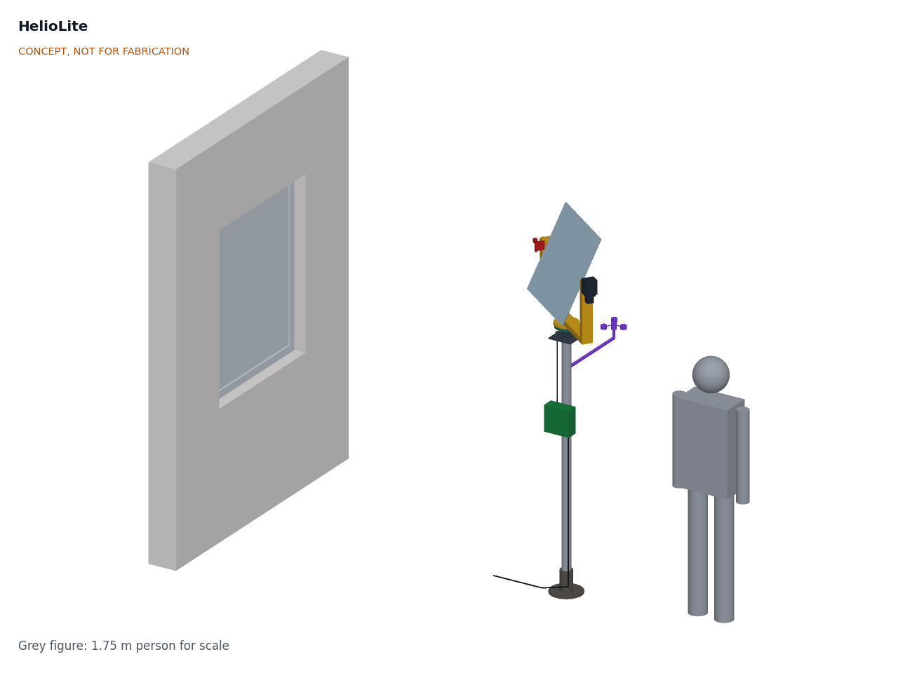
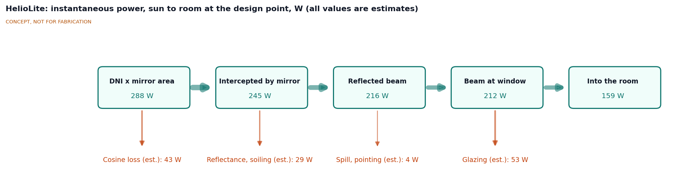
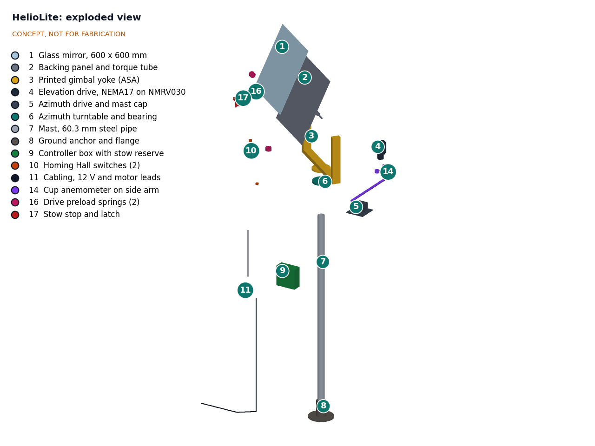

# HelioLite design precis

HelioLite is a 600 x 600 mm glass mirror on a two-axis, worm-driven gimbal at the top of a 60.3 mm steel mast. An ESP32 computes the sun's position from a real-time clock and the site location, and turns the mirror so its normal bisects the directions to the sun and to a fixed target window. It uses no sun sensor; a cup anemometer and a wind forecast tell it when to stow, a supercapacitor reserve lets it stow face-down after a power loss, and a stow latch then carries the storm load instead of the gearbox. The TRL 3 calculations (HLT-CAL-001) give about 211 W at the glazing and 159 W (about 15,000 lm, a mean of about 500 lx in a 12 m² room) at the design point, 0.50 kWh through the glazing on the winter solstice and 1.0 kWh on 1 February at a reference site, and a beam pointing error of 0.31° typical against 0.5°. With the decisions of HLT-DDR-002 applied, 11 of 15 requirements are met on paper; cost (R15) is not met at $451 in parts against the $430 budget, and daily energy (R3) and pointing (R4) are at risk.

*Figure 1. HelioLite on its mast with a 1.75 m person for scale. The house wall and target window are context and are drawn closer than a real site so the heliostat stays legible.*

## How it works

1. **Know the time and place.** A DS3231 real-time clock (±2 ppm from 0 to 40 °C, about ±1 min per year ([Adafruit DS3231 guide](https://learn.adafruit.com/adafruit-ds3231-precision-rtc-breakout/overview))) keeps UTC. When Wi-Fi is available the ESP32 corrects it by network time once a week. Latitude, longitude and the target direction are entered once at setup.
2. **Compute the sun.** Every 30 s the ESP32 runs Grena's algorithm 5 (maximum error 0.0027° for 2010 to 2110 ([Grena 2012](https://www.sciencedirect.com/science/article/abs/pii/S0038092X12000400))), with NREL SPA (±0.0003° ([Reda and Andreas](https://www.nrel.gov/docs/fy08osti/34302.pdf))) as the alternative, to get the unit vector **s** toward the sun. There is no sun sensor.
3. **Aim the mirror.** The required mirror normal is **n** = (**s** + **t**) / |**s** + **t**|, where **t** is the unit vector from the mirror to the target. A mount model with five terms (azimuth and elevation zero offsets, two base tilts and the mirror's cant on its torque tube) converts **n** into azimuth and elevation steps.
4. **Move.** Two NEMA17 steppers on NMRV030-class 50:1 worm gearboxes turn the yoke in azimuth and the mirror in elevation. A spiral preload spring of about 3 N·m on each axis keeps the worm teeth on one flank, so the gearbox's 1° backlash does not reach the beam; the elevation spring biases the mirror toward stow. The worms are self-locking, so the drivers switch off between moves. Hall switches home each axis at start-up.
5. **Calibrate.** At setup the user opens a web page served by the ESP32, jogs the sun spot onto the target center at four times spread over about 4 h, and the firmware fits the mount model to those points. No survey instrument is needed.
6. **Stow.** At night, on a fault, when the anemometer sees a 15 m/s gust or when the forecast predicts one, the mirror turns face-down. This sends no reflection anywhere, protects the glass from hail and dust, and presents the lowest wind load. On a power loss a supercapacitor bank in the controller box powers the stow. At the end of the stow a steel lug on the torque tube passes a sprung latch pawl and seats on a polyurethane stop pad on the -X arm; the pawl drops in without power, the firmware backs the worm off to mid-backlash, and from then on the stop and the pawl carry the wind moment in both directions. A 12 V pull solenoid lifts the pawl when the unit leaves stow.

The sun moves about 15° per hour, so between 30 s updates it moves about 0.125° and the mirror normal needs about half of that. The mirror's center of mass sits 13.7 mm in front of the elevation axis (HLT-CAL-001, [H4]), so the drives overcome a small gravity moment (up to 0.8 N·m) as well as friction and wind.

*Figure 2. Instantaneous power from the sun to the room at the design point (DNI 800 W/m², 10 m to the target, 32° incidence), in W. Values from HLT-CAL-001 [A2]; all are estimates.*

## Main components

Numbers match the exploded view (Figure 3), drawing HLT-DWG-001 and `bom/bom.csv`.

Table 1. Main components.

| # | Component | Choice | Notes |
| --- | --- | --- | --- |
| 1 | Mirror | 600 x 600 x 3 mm silvered glass, seamed edges, safety backing film | Decided (HLT-DDR-001, D10); cut by a local glazier |
| 2 | Backing panel and torque tube | 4 mm aluminum composite panel bonded to the mirror, two rib tubes, 25 mm square aluminum torque tube with 14 mm trunnion stubs | Carries the elevation axis 13.7 mm behind the mirror's center of mass |
| 3 | Gimbal yoke | 3D-printed ASA base plate, crossbar and two 40 x 70 mm arms at ±340 mm, with heat-set inserts and flanged bearings | Arms stand 20 mm outside the mirror's sweep so it can turn face-down; arm section set by stiffness (HLT-CAL-001, section C) |
| 4 | Elevation drive | NEMA17 stepper on an NMRV030-class 50:1 worm gearbox (17 N·m rated, 14 mm hollow bore) via an adapter plate | Outboard of the +X arm, on the trunnion |
| 5 | Azimuth drive and mast cap | Same drive, bore vertical, on a 160 mm steel cap plate | Carries the turntable |
| 6 | Azimuth turntable | 150 mm disc on a thrust bearing | Carries the yoke and mirror |
| 7 | Mast | 60.3 mm (2 in) galvanized steel pipe, 1.70 m | Decided (D1). Mirror center 2.2 m above ground |
| 8 | Ground anchor | Ground screw for 60 mm posts or a concrete footing, with a socket and flange | Must resist 0.79 kN·m; 1.0 kN·m specified |
| 9 | Controller box | ESP32, DS3231 RTC, two TMC2209 drivers, 12 V to 5 V buck, supercapacitor stow reserve (BOM line 15), IP65 box | On the mast at 1.1 m, reachable for service |
| 10 | Homing switches | Two Hall switches with magnets | Axis reference only; not sun sensors |
| 11 | Cabling | Motor leads, 2-core outdoor 12 V cable, cable glands | 12 V feed from indoors (D9) |
| 14 | Anemometer | Pulse-output cup anemometer on a 550 mm side arm at 1.5 m | Decided (D2); a weather sensor, not a sun sensor |
| 16 | Drive preload springs | Flat spiral springs of about 3 N·m in printed cans: elevation on the -X trunnion outboard of the arm, azimuth inside the mast top | Decided (HLT-DDR-002 N2); holds each worm on one flank |
| 17 | Stow stop and latch | 8 mm steel lug on the torque tube; steel bracket on the -X arm with a 3 mm polyurethane (90A) stop pad, a sprung steel latch pawl and a 12 V pull solenoid | Decided (HLT-DDR-002 N1); designed for 48.6 N·m, twice the assumed stowed moment |

A listed indoor 12 V, 3 A power adapter (line 12), the fasteners (line 13) and the stow reserve inside the controller box (line 15) are in the BOM without callouts.

*Figure 3. Exploded view with numbered callouts matching the BOM.*

The general arrangement, with main dimensions and interfaces, is drawing HLT-DWG-001 (`cad/drawings/HLT-DWG-001.pdf`), generated from the parametric model `cad/src/model.py`.

## Performance (HLT-CAL-001)

All values are paper calculations; tags refer to lines printed by `docs/04-calcs/sizing.py`.

### Optical power and daylight

Table 2. Power and daylight at the design point [A2, A3].

| Quantity | Value | Basis | Requirement |
| --- | --- | --- | --- |
| DNI times mirror area | 288 W | 800 W/m² x 0.36 m² | |
| Intercepted (after cosine) | 244 W | x 0.848 | |
| Reflected beam | 216 W | x 0.93 x 0.95 | |
| At the outside of the glazing | 211 W | 0.98 edge and spill allowance | R1 (200 W) met |
| Into the room | 159 W | x 0.75 | |
| Luminous flux into the room | about 15,070 lm | 95 lm/W | About ten 1,500 lm LED lamps |
| Mean added illuminance, 12 m² room | about 500 lx | utilization 0.4 | R2 (300 lx) met |
| Beam irradiance at the target | 0.88 to 0.93 of DNI | A flat mirror does not concentrate | See Safety |

### Daily energy, heat and siting

An hourly clear-sky model at 45° N with the house's shadow and the angle of the beam on the glass gives 0.50 kWh through the glazing on 21 December and 1.0 kWh on 1 February at reference site A (mirror 6 m east and 8 m north of the window). At site B, where the beam meets the glass at 58°, the solstice figure falls to 0.40 kWh; at site C, 15 m out on the window's axis, it rises to 1.0 kWh (HLT-CAL-001, Table 2). R3 (0.5 kWh) is at risk and depends on siting. A small, poorly insulated room may lose 0.5 to 1 kW in cold weather, so about 150 W is a noticeable but modest share of daytime heat, of the order of 15 to 30 % while the sun is out. The main benefit is light. On overcast days HelioLite delivers nothing.

### Beam size and spill

The spot is the mirror's projected outline blurred by the sun's 0.53° diameter. At 10 m it is about 0.65 m square and, with a 0.5° beam error either way, needs 0.82 m of a 1.0 m window. The limit for a 1.0 m wide window is about 17 m; beyond it spill onto the wall rises and a larger target is needed [A5, A6].

### Pointing

Table 3. Pointing error budget for the mirror normal [D4, D5].

| Source | Normal error | Basis |
| --- | --- | --- |
| Sun-position algorithm | 0.001° | Grena algorithm 5 |
| Clock, 6 months without network time | 0.066° | ±2 ppm, 31.5 s |
| Mount model residual after calibration | 0.116° | Median of a simulation with four points over 4 h (the decided default) |
| Worm backlash | 0.050° | With the decided preload springs holding each worm on one flank |
| Step resolution | 0.002° | 1.8° step, 16 microsteps, 50:1 |
| Mast bending at 8 m/s | 0.040° | 60.3 x 3.9 mm pipe |
| Yoke arm flex at 8 m/s | 0.040° | 40 x 70 mm printed ASA arms |
| **Root sum square** | **0.153°** | **Beam 0.31°; 0.50° at the 95th percentile of calibration** |

R4 is at risk because the 95th percentile of calibration sits at the 0.5° limit. The listed gearbox backlash is 1°, and without the preload springs the beam error could reach about 1°. Calibration points taken within half an hour cannot be fitted; four points over about 4 h are the default (HLT-DDR-002 N6; HLT-CAL-001, Table 3).

### Wind loads and drives

Table 4. Wind loads [E1].

| Wind | Pose | Force on mirror | Hinge moment | Mast base moment | Mast stress |
| --- | --- | --- | --- | --- | --- |
| 8 m/s (operating) | Tracking | 17 N | 2.1 N·m | 41 N·m | 5 MPa |
| 15 m/s (stow trigger) | Tracking | 60 N | 7.4 N·m | 146 N·m | 16 MPa |
| 35 m/s (survival) | Stowed face-down | 162 N | 24.3 N·m | 436 N·m | 48 MPa |
| 35 m/s (failure to stow) | Caught face-on | 324 N | 40.5 N·m | 793 N·m | 87 MPa, below 240 MPa yield |

The mast and anchor carry every case. The gearbox is rated 17 N·m (22 N·m listed maximum), enough up to the 15 m/s stow trigger but not for the assumed stowed moment at 35 m/s. In stow that moment goes into the stow stop and latch, which are designed for 48.6 N·m (a stowed coefficient up to twice the assumed value); the pad deflects 0.28 mm at that load, less than the 0.48 mm of free travel left with the worm at mid-backlash, so the gearbox carries no stowed moment and R9 is met on paper [E7, E8]. Caught face-on (a failed stow), the 40.5 N·m hinge moment still exceeds the gearbox.

### Stow on power loss

A worst-case stow takes 18 s of motion plus 5 s to detect the loss and needs 87 J; five 2.7 V, 25 F supercapacitors in series provide 187 J, a margin of 2.1 [F1, F2]. The stow turns the normal downward, so the beam moves only down toward the ground and disappears once the sun reaches the mirror's back; for about 2.8 s it crosses the ground between the target and the mast [F4], which R10 now allows (HLT-DDR-002 N5). The latch engages without power.

### Power, mass and cost

- **Power:** 0.60 W average, about 14 Wh per day (R14 met) [I1].
- **Mass:** mirror assembly 6.0 kg, yoke 2.7 kg, two drives 3.3 kg, turntable 0.5 kg, stow stop and latch 0.27 kg and springs 0.16 kg make 12.95 kg on the mast top against the relaxed 13 kg limit (R13 met, 0.05 kg margin); the mast adds 9.2 kg [H1 to H3].
- **Cost:** $451 in parts against the $430 budget (R15 not met, $21 over) [J1]. A budget change is proposed, awaiting Amish (HLT-DDR-002).

## Key design choices

Decided by Amish on 2026-09-25, going with the recommendation (HLT-DDR-001):

- **Mast (D1):** 60.3 mm galvanized steel pipe, rather than an 80 x 80 mm extrusion or a guyed 40 x 40 mm extrusion. The pipe tilts 0.040° at 8 m/s; a 40 x 40 mm extrusion would tilt 0.37°.
- **Storm awareness (D2):** a Wi-Fi wind forecast plus a cup anemometer, counted as a weather sensor, not a tracking sensor.
- **Safe state on power loss (D3):** a supercapacitor stow reserve.
- **Budget (D4):** $430.
- **Pitch (D5):** "with no sun sensors".
- **Face-down stow (D6)** at night, on a fault and before storms, rather than face-up (which sends the beam into the sky toward aircraft) or edge-on.
- **Calibration by jogged spot points (D7)**, three or more; four points over about 4 h are used in the budget.
- **Algorithm and time (D8):** Grena algorithm 5 at 30 s, NREL SPA as an alternative, weekly network time.
- **Power supply (D9):** a listed indoor 12 V adapter with only SELV cable outdoors.
- **Mirror (D10):** glass with a safety backing film.

Selected at TRL 3 to make the checks possible: NMRV030-class 50:1 gearboxes, chosen because a rating and backlash are listed at a price within budget, and 40 x 70 mm yoke arms, sized for stiffness.

Decided by Amish on 2026-09-25, going with the recommendation (HLT-DDR-002):

- **Stowed wind survival (N1):** stow stops on the yoke that carry the stowed hinge moment in both directions (option B), checked against a published-coefficient margin (option C) by designing for twice the assumed coefficient. Because a fixed stop cannot resist both directions on an axis that turns into the stow, the stops take the form of a stop pad and a sprung latch pawl.
- **Drive preload (N2):** a spiral spring of about 3 N·m on each axis, about $6 for both.
- **Mass (N3):** R13 relaxed to 13 kg; installation stays a two-person job.
- **Calibration wording (N4):** R7 counts hands-on time spread over one clear day.
- **Stow transient (N5):** R10 allows the beam to move only downward during a stow.
- **Calibration points (N6):** four points over about 4 h as the default, within D7.

Proposed, awaiting Amish: a budget figure that covers the $451 BOM (no figure was recommended with the decisions above).

## Safety

> **Safety:** HelioLite redirects sunlight, moves under motor power, carries a glass mirror 2.2 m above the ground and stands in the wind. Treat the beam, the moving gimbal, the glass and the mast as hazards at every stage.

- **Eye injury and glare.** Looking into the reflected beam is like looking at the sun, at 0.88 to 0.93 of its brightness. A brief glance causes an after-image; staring can cause retinal injury ([Ho, Ghanbari and Diver 2011](https://www.sandia.gov/app/uploads/sites/167/2025/03/Methods_Ho_2011.pdf)). Site the unit so the beam path crosses no path, road, neighbor's window or flight approach; mount the mirror above head height; never aim at people, vehicles or aircraft; and make the firmware refuse any target that is not the calibrated one.
- **Beam sweep.** During slews, calibration and stows the beam can pass across the surroundings. Stows always turn the normal downward so the beam moves toward the ground; during a power-loss stow it crosses the ground between the target and the mast for about 3 s. Keep that strip clear of seating and paths. Calibration jogs move the spot near the target; the user should stand beside, not in, the beam path.
- **Concentration and fire.** One flat mirror does not concentrate sunlight, but several mirrors aimed at one spot, or a mirror bent concave by its mounting, can. Do not aim more than one unit at the same spot, and check the mirror for flatness after mounting.
- **Glass.** A broken mirror has sharp edges and can fall from 2.2 m. Use seamed edges and a safety backing film, wear cut-resistant gloves and eye protection when handling, and keep the mirror face-down in hail.
- **Moving machinery.** The worm drives turn slowly but with high torque (up to 17 N·m at the output) and can trap fingers between the mirror, torque tube and yoke, where the gaps are only 20 to 46 mm, and between the stow lug and the latch bracket, where the gap is 3 to 9 mm. The preload springs store energy even when the drives are off, and the elevation spring pulls the mirror toward stow if a drive is disconnected. The latch pawl snaps shut under spring force. Disable the drives and discharge the stow reserve before servicing, and keep the gimbal above head height.
- **Stored energy.** The supercapacitor bank holds about 360 J at 12 V and can deliver high current if shorted. Fuse its output, bleed it on shutdown and mark the controller box.
- **Mast and wind.** A falling mast or mirror can injure people. Use an anchor rated for at least 1.0 kN·m, check for buried services before driving a ground screw, and stow before storms. The stow latch is designed on an assumed stowed load; until it is tested (TRL 4, on hold), remove the mirror if a storm with gusts above about 29 m/s is forecast. Two people install the mirror.
- **Electrical.** Only 12 V DC runs outdoors. The mains adapter stays indoors and must be a listed product; do not run mains to the mast.
- **Working at height.** Rooftop sites need fall protection and a structural check of the roof; they are not recommended for the first build.

## Open questions

- Budget for the $451 BOM (proposed, awaiting Amish).
- Confirm gearbox, spring and solenoid masses (R13 has only 0.05 kg of margin), and the gearbox's backlash, from suppliers' drawings; find a published stowed coefficient for small heliostats to confirm the latch margin.
- First site and user (HLT-DDR-001, O1), local rules on glare and structures (O2) and a siting survey (O3) using the hourly model in HLT-CAL-001.
- Whether daylight or heat is the benefit users value most.

TRL 4 work (building and testing) is on hold by Amish's instruction.

Concept media: [blueprint sheet](../media/concept-blueprint.pdf), [interactive 3D model](../media/viewer.html). General arrangement: [HLT-DWG-001](../cad/drawings/HLT-DWG-001.pdf).
