# HelioLite prototype build plan

**Plan, not yet built.** How to build the first proof-of-concept prototype, component by component. Building and testing to it is TRL 4 work. Decisions still to be made are kept in the design decisions register ([docs/06-design-decisions.md](06-design-decisions.md)), not here.

## 1. What you are building

*Figure 1. Every component pulled apart and numbered in build order. The mirror is shown face-down, as it stows, and the mast is drawn shortened.*

The prototype is one HelioLite: a 600 mm square glass mirror on a two-axis gimbal at the top of a 2 in steel pipe mast, with its elevation axis 2.2 m above the ground. The mirror is bonded to an aluminum composite panel stiffened by two rib tubes and a square torque tube; the torque tube turns in two bronze bushes in an aluminum yoke; a worm gearbox turns the mirror in elevation and a second one, on a steel cap on the mast top, turns the whole yoke in azimuth. A steel lug on the torque tube, a stop pad on an aluminum bracket and a sliding pawl hold the mirror face-down in storms. A black rubber edge channel guards the glass and panel edges. A controller box and a cup anemometer are clamped to the mast. Figure 1 shows the 26 components in the order you make or fit them. Fifteen kinds of part are made in a small workshop, each with its own making sketch: the ribs, torque tube, trunnion end blocks and stubs, stow lug, crossbar, right and left arms, gusset plates, the latch bracket with its stop block and pawl, the cap plate, the turntable disc and the controller mounting plate, and three printed parts (the bearing plugs, the spring cans and a switch post). Everything else is bought and fitted. The work is sawing, drilling, tapping, reaming and filing aluminum and steel, bonding with structural silicone, 3D printing in ASA and wiring bought electronic modules. The parts cost about USD 499 from the bill of materials.

> **Safety:** The finished mirror reflects a beam nearly as bright as the sun. Keep the glass covered with card from the moment it is bonded (step 5) until calibration, which is outside this plan, and never uncover it where the beam can reach a person, a road or the sky. The glass is heavy and its edges are sharp: two people, cut-resistant gloves and eye protection whenever it is handled. The worm drives turn slowly with high torque and the preload springs store energy even with the power off. The stow reserve holds about 360 J at 12 V. Cut metal edges are sharp: deburr everything. Printing ASA gives off fumes; print in a ventilated space. The head goes up 2.2 m in two lifts: two people on a stable platform, and a check for buried services before the ground anchor is driven.

## 2. What changed to make it buildable

The concept showed what HelioLite does; some of its parts could not be made or fixed as drawn. Each change below keeps what HelioLite does, and all of them are recorded in decision record HLT-DDR-003, accepted by Amish on 2026-10-02.

*Table 1. Changes from the concept.*

| Component | The concept had | The buildable design has | Why |
| --- | --- | --- | --- |
| Rib tubes | 25 x 20 mm ribs crossing the torque tube in the same space | 25 x 40 mm ribs, each with a square tunnel the torque tube slides through (Figure 3) | The tube still touches the panel, so the mirror's balance is unchanged; the square tunnel carries the wind moment |
| Trunnions | One 14 mm rod loose inside the square tube | An end block bolted in each tube end and a separate stub pinned into each block after the mirror is in the yoke (Figures 4 and 13) | The mirror can be fitted first and the stubs slid in from outside |
| Yoke | One printed ASA piece, 720 mm wide | Aluminum rectangular tube, a crossbar and two arms joined by gusset plates, with printed bearing plugs (Figure 11) | No common printer can print the concept's yoke; the tube frame is stiffer and lighter |
| Trunnion bearings | Bearings drawn with no housing | A flanged bronze bush through each arm and its plug; the flanges locate the tube ends (Figure 13) | Suits a slow axis; nothing to house |
| Elevation gearbox and spring | No fixings; the spring can stood off the arm | Gearbox bolted flat to the right arm; spring can screwed to the left arm, stub in its centre (Figures 13 and 14) | Both now act between the arm and the mirror |
| Azimuth stack | Turntable sat loose on the gearbox; nothing drove the spring in the mast | Keyed shaft through gearbox, cap and spring can; thrust washer, keyed hub and a 120 mm disc on top (Figure 23) | Every part fixed; stack height unchanged |
| Mast cap | "Welded or bolted to a pipe socket" | A threaded floor flange on the pipe; the cap screws to it from below (Figure 23) | No welding |
| Stow latch | Lug loose on the tube; a pawl that lifted inside the lug's swing; a bracket mostly off the arm | Lug on a square collar with a set screw; a pawl that slides sideways out of the lug's path; an aluminum angle bracket with a stop block under the pad (Figure 17) | The latch can now release; every part is held |
| Homing switches | Placed where nothing passed them | Azimuth switch on a post under a magnet in the disc; elevation switch beside a magnet in the lug (Figures 17 and 23) | Each switch now sees its magnet |
| Controller box, anemometer, mast | Floating beside the mast; mast loose in its socket | Plate and two U-bolts; a right-angle clamp; two set bolts in the socket (Figures 25 and 26) | Standard pole fixings |
| Cabling | Through the anchor flange; nothing to the turning yoke | Rerouted round the flanges, with a service loop to the crossbar (step 18) | Allows plus or minus 135 degrees of azimuth |

## 3. Making the components

Make and check each component before the assembly step that needs it. Sizes are in millimetres. "Left" and "right" are as seen standing in front of the mirror, looking at the glass: the right arm carries the elevation drive and the left arm carries the stow latch. Workshop tolerance is 0.5 mm unless a step says otherwise; drawings do not carry tolerances before TRL 4.

### 3.1 Rib tubes (make 2)

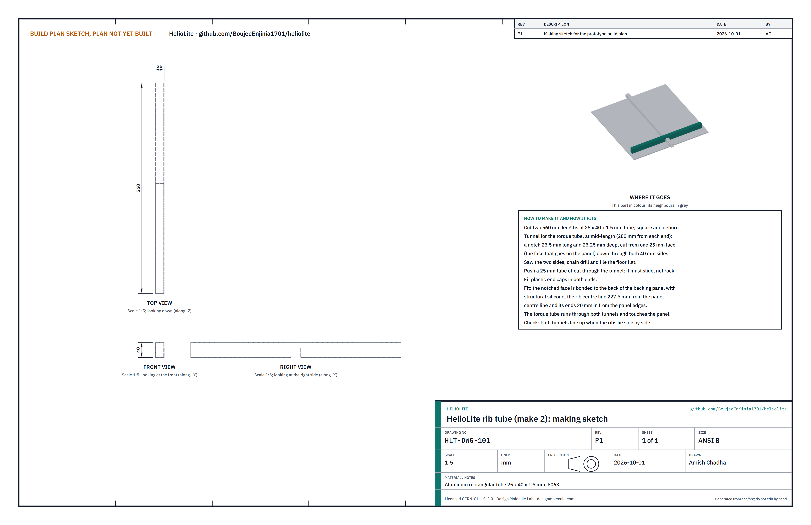

*Figure 2. Rib tube making sketch (HLT-DWG-101).*

**What it is and what it is made from.** The two stiffeners bonded across the back of the mirror panel, each with a tunnel the torque tube runs through. Aluminum rectangular tube 25 x 40 x 1.5 mm, 6063 class.

**How to make it.**

1. Cut two 560 mm lengths; square and deburr the ends.
2. Choose one 25 mm face as the panel face. At mid-length, 280 from each end, mark a notch 25.5 long.
3. Saw down both 40 mm sides 25.25 deep from the panel face, chain drill across, and file the floor of the notch flat and square.
4. Push an offcut of the 25 mm torque tube through the tunnel: it must slide without rocking.
5. Fit plastic end caps.

**How it fits the parts next to it.**

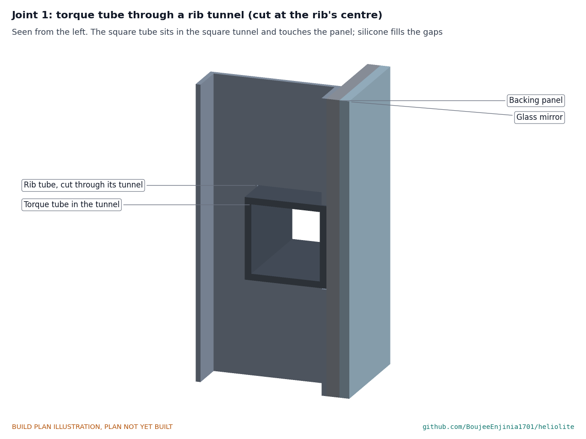

*Figure 3. Cut through the rib's centre: the square torque tube sits in the square tunnel and touches the panel.*

The notched face is bonded flat to the back of the backing panel with structural silicone, the rib's centre line 227.5 from the panel's centre line and its ends 20 in from the panel edges. The torque tube runs through both tunnels and is bonded in them and to the panel.

**Check before moving on.** Lay the two ribs side by side: the tunnels line up.

### 3.2 Torque tube

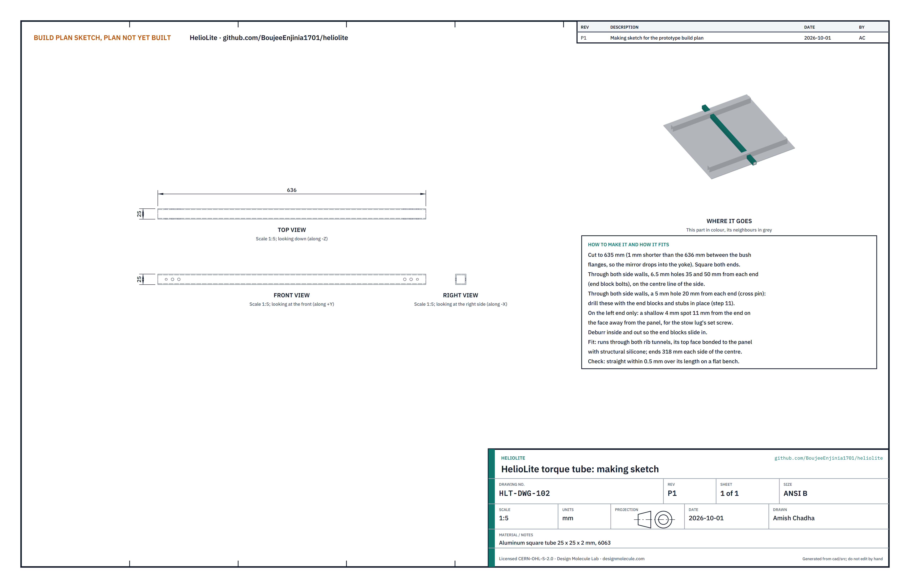

*Figure 4. Torque tube making sketch (HLT-DWG-102).*

**What it is and what it is made from.** The elevation axle of the mirror. Aluminum square tube 25 x 25 x 2 mm, 6063 class.

**How to make it.**

1. Cut to 635, 1 mm shorter than the 636 between the bush flanges, so the mirror drops into the yoke. Square both ends.
2. Through both side walls, on the centre line of the side, drill 6.5 holes 35 and 50 from each end for the end block bolts.
3. On the left end only, spot a shallow 4 mm dimple 11 from the end, on the face away from the panel, for the stow lug's set screw.
4. Deburr inside and out so the end blocks slide in. The 5 mm cross pin holes, 20 from each end, are drilled later with the stubs in place (step 17).

**How it fits the parts next to it.** It lies on the panel's centre line through both rib tunnels, its top face bonded to the panel, its ends 318 each side of the centre (Figure 3). The end blocks go inside its ends (section 3.3); the stow lug goes on its left end (section 3.4).

**Check before moving on.** Straight within 0.5 mm along its length on a flat bench.

### 3.3 Trunnion end blocks and stubs (make 2 of each)

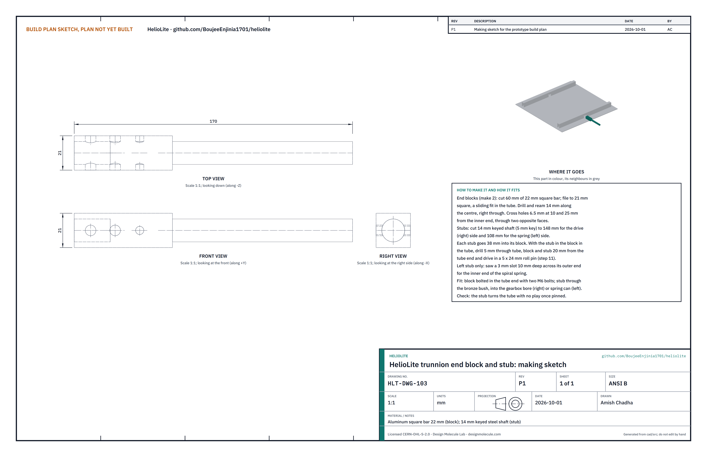

*Figure 5. End block with its stub in place (HLT-DWG-103).*

**What it is and what it is made from.** Each end block is a short square plug in the end of the torque tube; each stub is the short shaft that carries the mirror in its bush. Blocks: aluminum square bar 22 mm. Stubs: 14 mm keyed steel shaft with a 5 mm key.

**How to make it.**

1. Blocks: cut two 60 lengths of 22 mm square bar and file each to 21 square, a sliding fit in the tube.
2. Drill and ream 14 along the centre, right through each block.
3. Drill 6.5 cross holes 10 and 25 from the block's inner end, through two opposite faces.
4. Stubs: cut the keyed shaft to 148 for the drive (right) stub and 108 for the spring (left) stub. Deburr the ends.
5. On the spring stub only, saw a 3 mm slot 10 deep across its outer end for the inner end of the spiral spring.

**How it fits the parts next to it.** Each block slides into a tube end, flush with it, and is held by two M6 bolts through tube and block with nyloc nuts (step 3). After the mirror is in the yoke on the mast, each stub slides in through its bush, 38 into the block, and a 5 x 24 mm roll pin goes through tube, block and stub 20 from the tube end (step 17). The drive stub goes in through the elevation gearbox's hollow bore, already on the arm, with its key; the spring stub ends inside the spring can (Figure 13).

**Check before moving on.** Each block slides in its tube end without forcing; each stub slides through a 14 mm bronze bush.

### 3.4 Stow lug

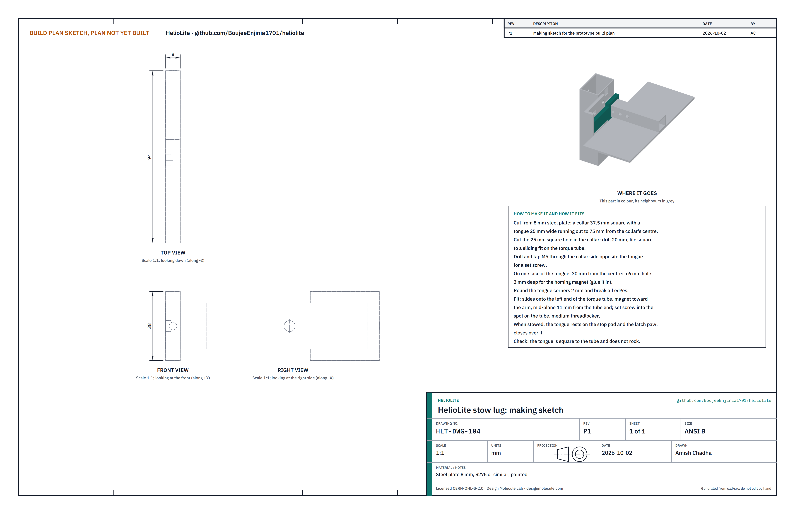

*Figure 6. Stow lug making sketch (HLT-DWG-104).*

**What it is and what it is made from.** The steel tongue that the latch traps when the mirror is stowed. Steel plate 8 mm, S275 class, painted.

**How to make it.**

1. Cut a collar 37.5 square with a tongue 25 wide running out to 75 from the collar's centre (94 overall).
2. Cut the 25 square hole in the collar: drill 20, then file square to a sliding fit on the torque tube.
3. Drill and tap M5 through the collar side opposite the tongue for a set screw.
4. On one face of the tongue, 30 from the collar's centre, drill a 6 mm hole 3 deep and glue in a 6 x 3 mm magnet for the elevation homing switch.
5. Round the tongue corners 2 mm and break all edges.

**How it fits the parts next to it.** It slides onto the left end of the torque tube, magnet toward the tube end, its mid-plane 11 from the end, with the tongue pointing across the panel as step 4 shows. The set screw goes into the dimple with medium threadlocker. When the mirror is stowed the tongue rests on the stop pad and the latch pawl closes over it (Figure 17).

**Check before moving on.** The tongue is square to the tube and the collar does not rock once the set screw is tight.

### 3.5 Glass mirror and backing panel (bought)

**What to buy.** A 600 x 600 x 3 mm silvered float glass mirror with seamed edges and a safety backing film, cut by a local glazier; 2.5 m of black EPDM U edge channel for a 7 mm edge, with a 3 mm lip over the glass and an 8 mm lip over the panel back; a 600 x 600 x 4 mm aluminum composite panel; mirror adhesive that is safe on the mirror's backing paint; structural silicone. **What to do to them.** Nothing but cleaning: the ribs and tube are bonded to the panel (steps 1 and 2) and the glass to its other face (step 5); the edge channel is cut to length and pressed on after the glass is bonded (step 5).

### 3.6 Crossbar

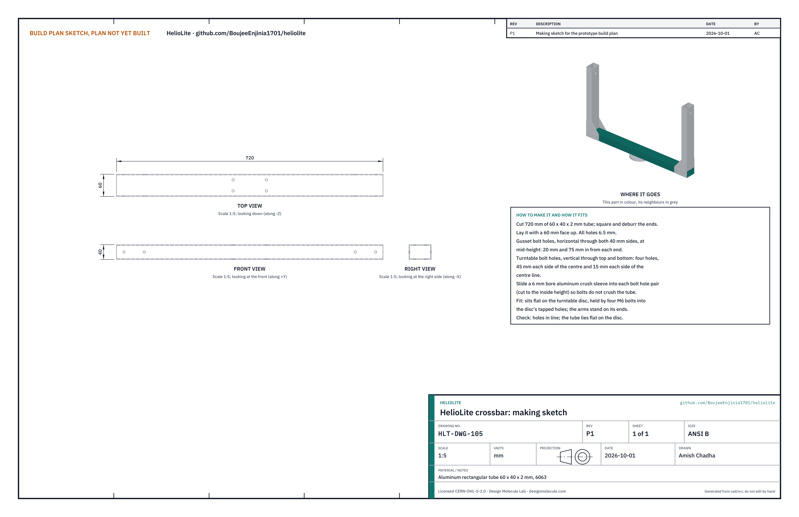

*Figure 7. Crossbar making sketch (HLT-DWG-105).*

**What it is and what it is made from.** The bottom of the yoke; it sits on the turntable disc and carries the arms on its ends. Aluminum rectangular tube 60 x 40 x 2 mm, 6063 class.

**How to make it.**

1. Cut 720 long; square and deburr the ends. Lay it with a 60 mm face up.
2. Gusset bolt holes, 6.5, horizontal through both 40 mm sides at mid-height: 20 and 75 in from each end.
3. Turntable bolt holes, 6.5, vertical through top and bottom: four, 45 each side of the centre and 15 each side of the centre line.
4. Cut aluminum crush sleeves (8 mm outside, 6.5 inside) to the inside height of the tube and slip one into each pair of holes.

**How it fits the parts next to it.** Sits flat on the turntable disc, held by four M6 bolts into the disc's tapped holes (Figure 23). The arms stand on its ends and the gusset plates clamp both (Figure 11).

**Check before moving on.** The holes line up through both walls; the tube lies flat on a bench.

### 3.7 Arms (make 2: a right and a left)

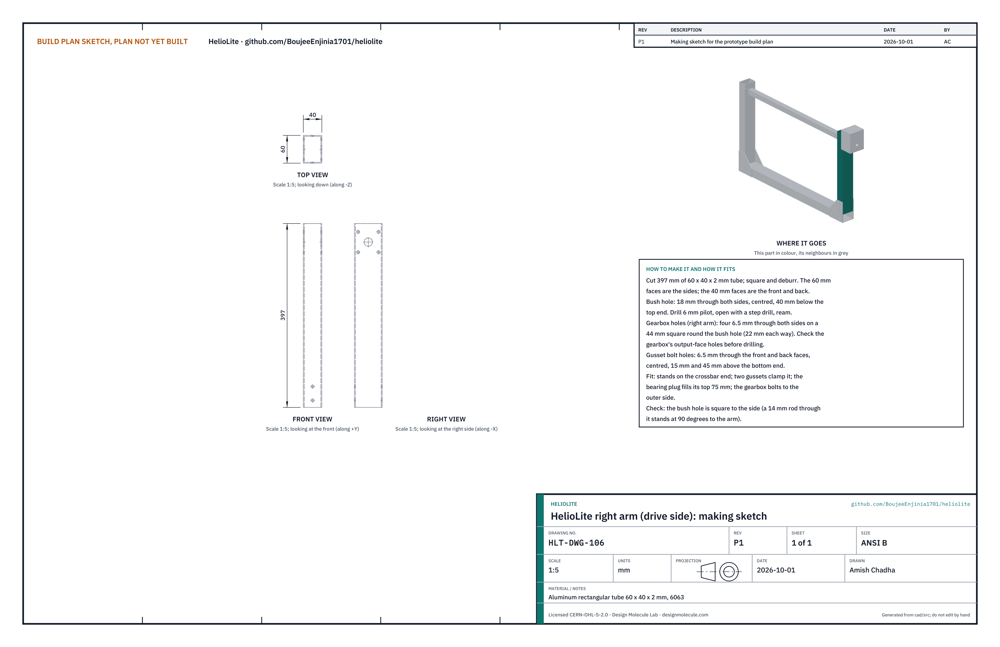

*Figure 8. Right (drive side) arm making sketch (HLT-DWG-106).*

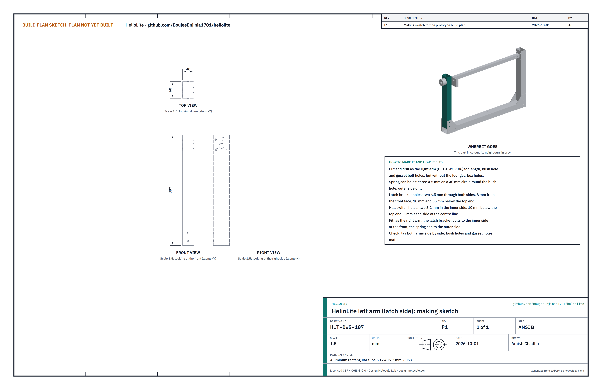

*Figure 9. Left (latch side) arm making sketch (HLT-DWG-107).*

**What it is and what it is made from.** The two uprights of the yoke that carry the mirror's bushes. Aluminum rectangular tube 60 x 40 x 2 mm, 6063 class. The 60 mm faces are the sides (toward and away from the mirror); the 40 mm faces are the front and back.

**How to make it.**

1. Cut two 397 lengths; square and deburr.
2. Bush hole: 18 through both sides, centred, 40 below the top end. Drill a 6 mm pilot on a drill press, open with a step drill and ream so a 14 x 18 bush slides in.
3. Gusset bolt holes: 6.5 through the front and back faces, centred, 15 and 45 above the bottom end.
4. Right arm only: four 6.5 holes through both sides on a 44 square round the bush hole (22 each way), for the gearbox. Check the bought gearbox's output-face holes before drilling.
5. Left arm only: two 6.5 holes through both sides, 8 from the front face, 18 and 55 below the top end, for the latch bracket; three 4.5 holes in the outer side on a 40 circle round the bush hole, for the spring can; a window 13 wide and 16 tall through the inner side only, 1.5 below the top end and centred across the side, for the Hall switch.

**How it fits the parts next to it.** Each arm stands on a crossbar end, flush with it, clamped by two gusset plates (Figure 11). The bearing plug fills its top 75 and the bush passes through arm, plug and arm (Figure 13). The gearbox bolts to the right arm's outer side (Figure 14); the latch bracket to the left arm's inner side and the spring can to its outer side; the Hall switch sits in its window on the bearing plug, 1 mm proud of the arm, so the torque tube's end passes it as the mirror is lowered in.

**Check before moving on.** A 14 mm rod through the bush hole stands square to the arm; laid side by side, both arms' bush and gusset holes match.

### 3.8 Gusset plates (make 4)

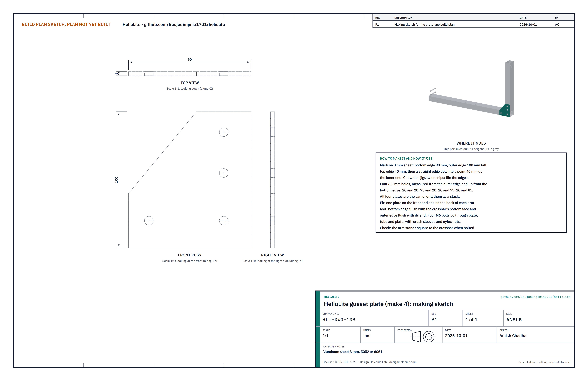

*Figure 10. Gusset plate making sketch (HLT-DWG-108).*

**What it is and what it is made from.** The plates that make each arm-to-crossbar joint rigid. Aluminum sheet 3 mm, 5052 or 6061 class.

**How to make it.**

1. Mark the outline: bottom edge 90, outer edge 100 tall, top edge 40 in from the outer edge, then a straight edge down to a point 40 up the inner end.
2. Cut with a jigsaw or snips and file the edges straight.
3. Clamp the four blanks in a stack and drill four 6.5 holes, measured in from the outer edge and up from the bottom edge: 20 and 20; 75 and 20; 20 and 55; 20 and 85.

**How it fits the parts next to it.**

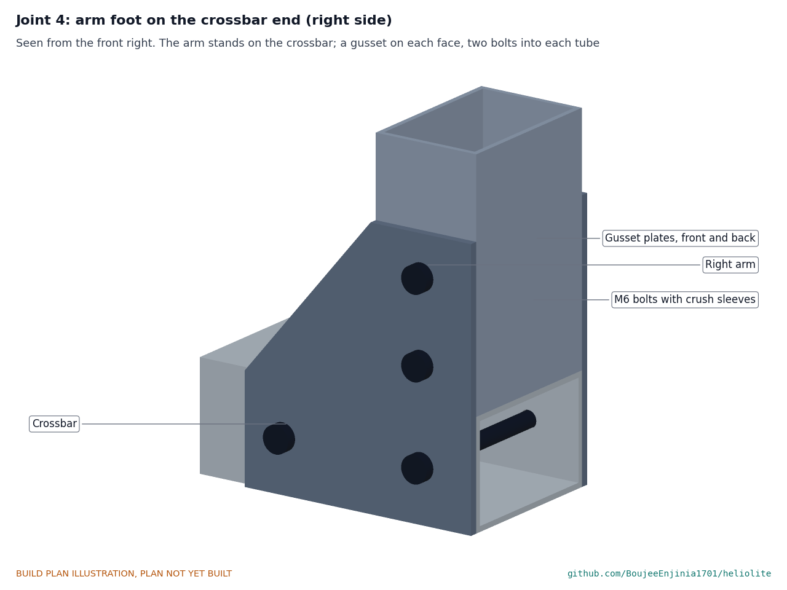

*Figure 11. A gusset on the front and one on the back of each arm foot; two bolts into the crossbar, two into the arm.*

One plate goes on the front face and one on the back face of each arm foot, bottom edge flush with the crossbar's bottom face and outer edge flush with its end. Four M6 bolts pass through plate, tube (through its crush sleeves) and plate, with nyloc nuts.

**Check before moving on.** With the four bolts tight, the arm stands square to the crossbar (check with a square both ways).

### 3.9 Bearing plugs (make 2, printed)

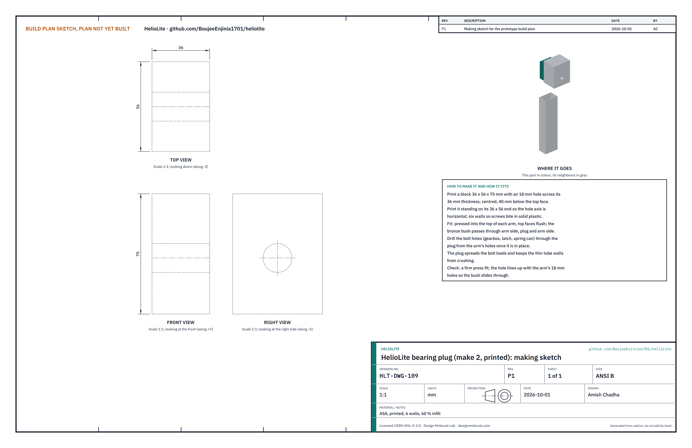

*Figure 12. Bearing plug making sketch (HLT-DWG-109).*

**What it is and what it is made from.** A printed block that fills the top of each arm, so the bush, the gearbox bolts and the latch screws bear on solid plastic, not on the thin tube walls. ASA, six walls, 60 % infill.

**How to make it.**

1. Print a block 36 x 56 x 75 with an 18 hole across its 36 mm thickness, centred, 40 below the top face. Print it standing on its 36 x 56 end, in an enclosed printer.
2. Let it cool on the bed. Check it is a firm press fit in the arm.

**How it fits the parts next to it.**

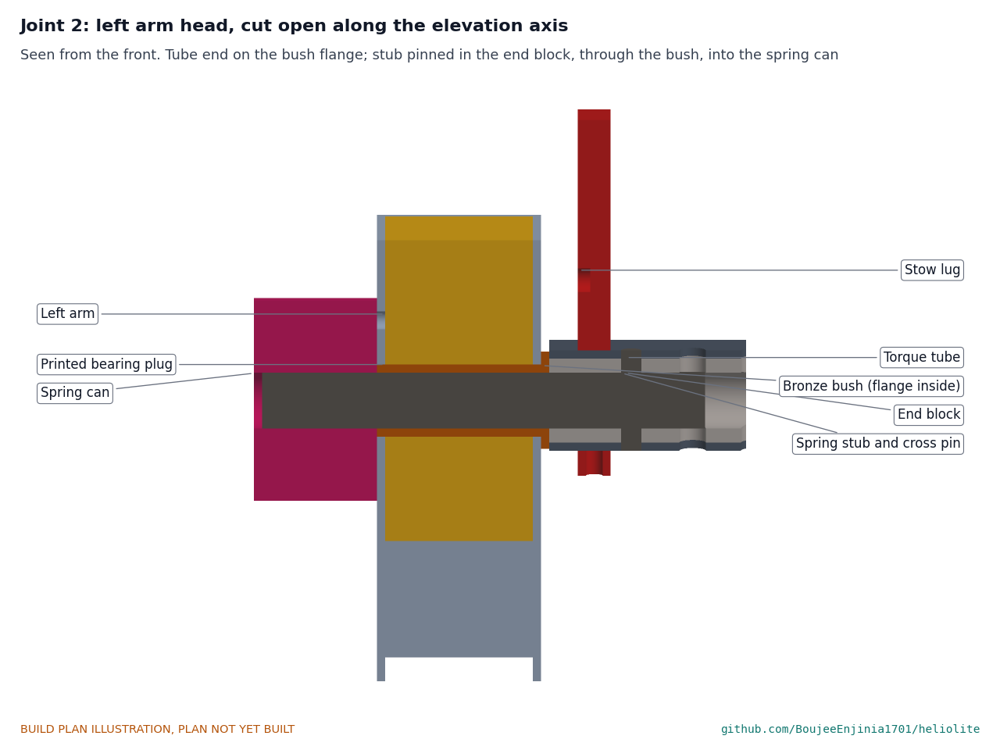

*Figure 13. Tube end against the bush flange; the stub pinned in the end block, through the bush, into the spring can.*

Pressed into the top of each arm, flush (step 7). The bronze bush passes through arm side, plug and arm side with its flange inside, toward the mirror; the torque tube's end rests against the flange. Drill the bolt holes for the gearbox, latch and spring can through the plug from the arm's holes once it is in place.

**Check before moving on.** The bush slides through arm and plug without forcing.

### 3.10 Elevation gearbox and motor (bought)

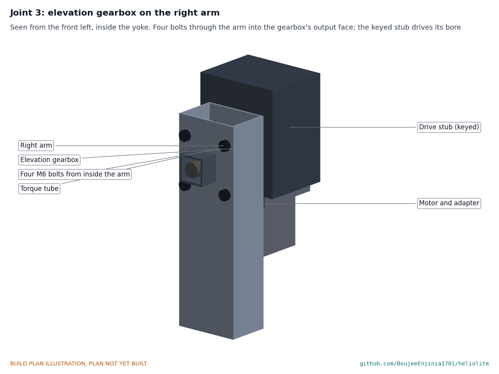

*Figure 14. Seen from inside the yoke: four bolts through the right arm hold the gearbox's output face flat against it; the keyed drive stub runs through its hollow bore; the motor hangs below.*

**What to buy.** An NMRV030-class 50:1 worm gearbox with a 14 mm hollow bore and a NEMA17 input flange, a NEMA17 stepper (48 mm, about 0.45 N·m), the adapter plate and the 5 to 11 mm shaft sleeve; the same again for azimuth, plus that gearbox's 14 mm double output shaft with its key. **What to do to it.** Fit the motor to the gearbox with the adapter, as the maker describes. The elevation gearbox bolts to the right arm with four M6 bolts from inside the arm into its output-face holes; the azimuth gearbox screws to the cap plate (section 3.12).

### 3.11 Latch bracket, stop block and pawl

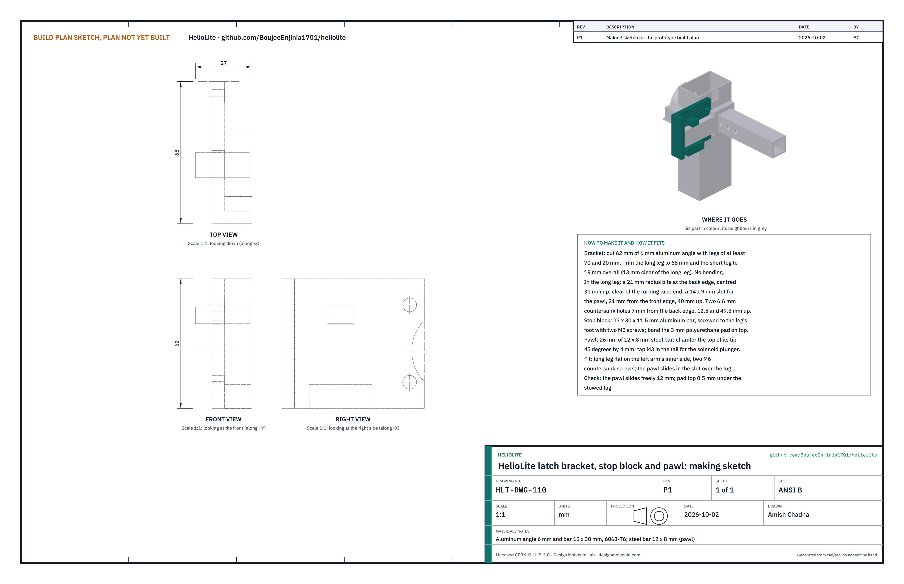

*Figure 15. Latch bracket with its stop block and the pawl in its slot (HLT-DWG-110).*

**What it is and what it is made from.** The bracket on the left arm that carries the stop pad under the stowed lug and the pawl that closes over it. Aluminum angle 6 mm thick and aluminum bar 15 x 30, 6063-T6, left bare; steel bar 12 x 8 for the pawl, painted. The pad is 3 mm polyurethane, 90 Shore A.

**How to make it.**

1. Bracket: cut 62 of 6 mm aluminum angle with legs of at least 70 and 20. Trim the long leg to 68 and the short leg to 19 overall, so 13 stands clear of the long leg. No bending is needed.
2. In the long leg: cut a 21 radius bite out of the back edge, centred 31 up, so the turning tube end clears it; cut a 14 x 9 slot for the pawl, 21 from the front edge and 40 up; drill two 6.6 holes 7 from the back edge, 12.5 and 49.5 up, countersunk on the side away from the arm.
3. Stop block: cut 13 x 30 x 11.5 from aluminum bar; drill and tap two M5 holes in its 30 x 11.5 face; screw it to the foot of the leg from the arm side with two M5 screws. Bond the polyurethane pad on its top.
4. Pawl: cut 26 of 12 x 8 steel bar; chamfer the top edge of its tip 45 degrees by 4; tap M3 in its tail for the solenoid's plunger.

At the design storm load the pawl bends the aluminum leg to about a fifth of the metal's yield stress, and the 6 mm leg is a little stiffer than the 4 mm steel bracket it replaces, so the pad still sets how far the stowed mirror can move.

**How it fits the parts next to it.**

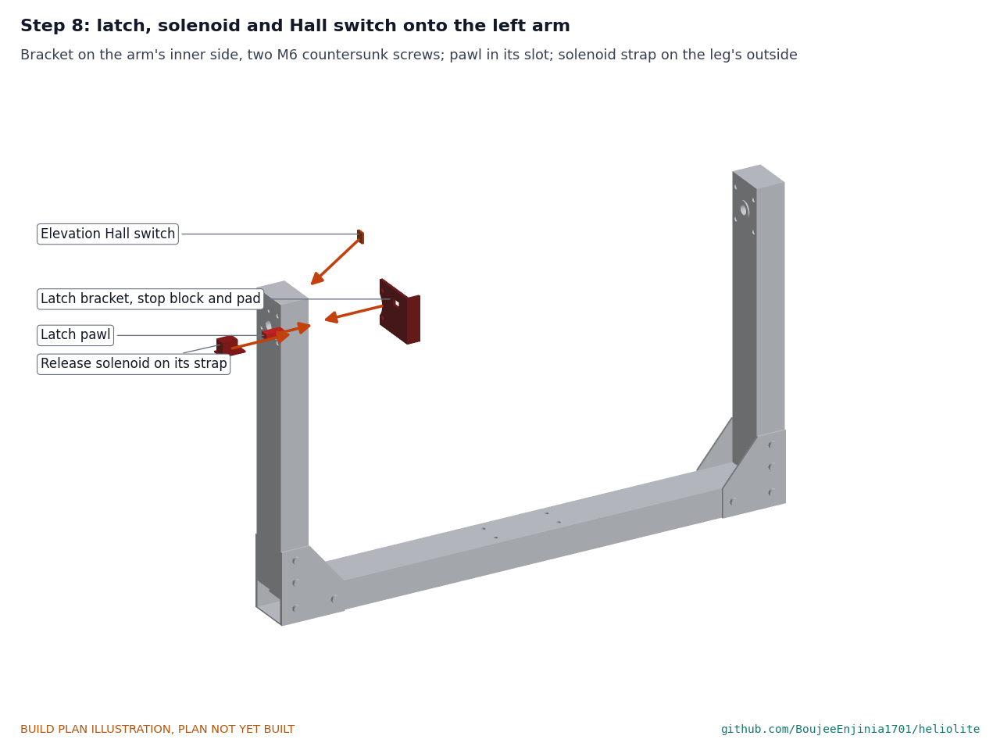

*Figure 16. Where the bracket, pawl, solenoid and Hall switch go on the left arm.*

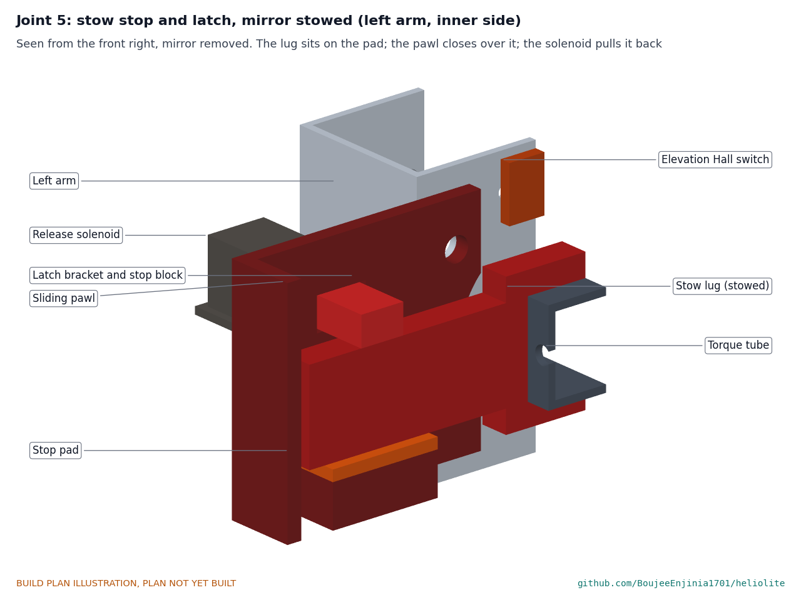

*Figure 17. The lug rests on the pad; the pawl closes over it; the solenoid on the outside of the leg pulls the pawl back to release.*

The long leg lies flat on the left arm's inner side at the front, held by two M6 countersunk screws through the arm and plug with nyloc nuts on the outside. The pawl slides in its slot, its chamfer up, its tip 1 mm past the lug's far face when out and 3 mm clear of the lug when pulled back 12. The solenoid is screwed on a strap to the outside of the leg, beside the arm, its plunger screwed into the pawl's tail; its return spring pushes the pawl out. When the mirror stows, the lug's edge hits the chamfer, pushes the pawl back, passes under it and lands on the pad 0.5 below its resting place; the pawl springs out over it.

**Check before moving on.** The pawl slides freely through its full 12 stroke by hand and springs back out.

### 3.12 Mast cap plate

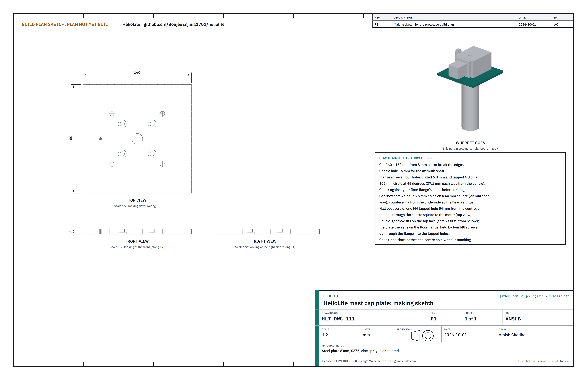

*Figure 18. Cap plate making sketch (HLT-DWG-111).*

**What it is and what it is made from.** The steel plate on the mast top that carries the azimuth gearbox. Steel plate 8 mm, S275 class, zinc sprayed or painted after drilling.

**How to make it.**

1. Cut 160 x 160 and break the edges.
2. Drill a 16 centre hole for the azimuth shaft.
3. Drill 6.8 and tap M8 four holes on a 105 circle at 45 degrees (37.1 each way from the centre) for the floor flange screws. Check the flange's own holes before drilling.
4. Drill four 6.6 holes on a 44 square (22 each way), countersunk from the underside, for the gearbox.
5. Drill 3.3 and tap M4 one hole 54 from the centre, on the line through the centre square to the motor's axis, on the side the drawing shows, for the Hall switch post.

**How it fits the parts next to it.** The azimuth gearbox sits on its top face, held by four countersunk M6 screws from below, fitted before the cap goes on the mast (step 14). The plate sits flat on the floor flange, held by four M8 screws up through the flange into its tapped holes (Figure 23).

**Check before moving on.** The shaft passes the centre hole without touching; the screw heads sit flush or below the underside.

### 3.13 Turntable disc

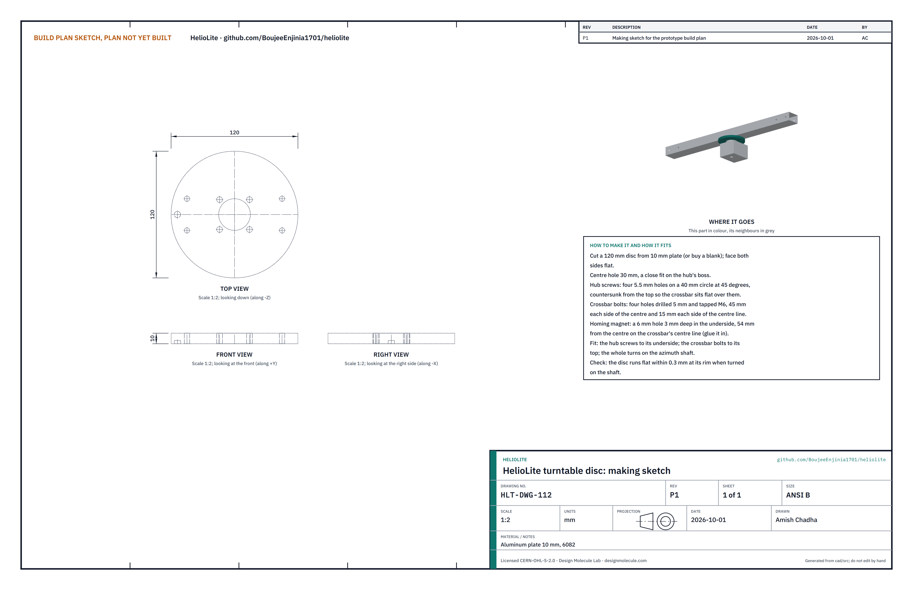

*Figure 19. Turntable disc making sketch (HLT-DWG-112).*

**What it is and what it is made from.** The disc that joins the azimuth shaft to the yoke. Aluminum plate 10 mm, 6082 class.

**How to make it.**

1. Cut a 120 disc (or buy a blank) and face both sides flat.
2. Bore a 30 centre hole, a close fit on the hub's boss.
3. Four 5.5 holes on a 40 circle at 45 degrees, countersunk on the top, for the hub screws.
4. Drill 5 and tap M6 four holes, 45 each side of the centre and 15 each side of the centre line, for the crossbar bolts.
5. In the underside, 54 from the centre on the crossbar's centre line, drill a 6 mm hole 3 deep and glue in a magnet for the azimuth homing switch.

**How it fits the parts next to it.** The hub screws to its underside; the crossbar bolts to its top; it turns on the azimuth shaft 4 above the switch post (Figure 23).

**Check before moving on.** Turned on the shaft, the rim runs flat within 0.3 mm.

### 3.14 Spring cans (make 2, printed)

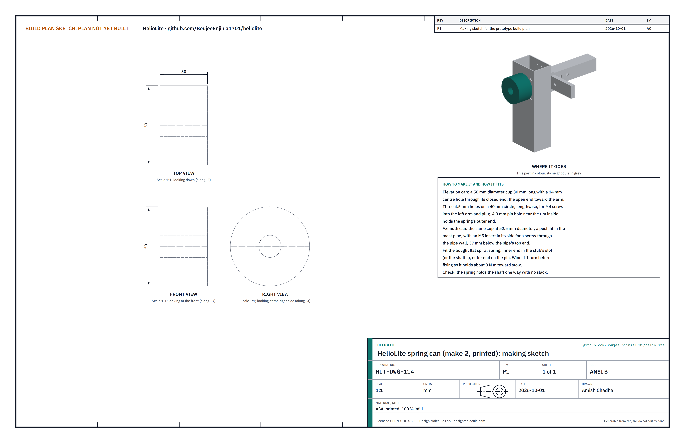

*Figure 20. Spring can making sketch (HLT-DWG-114).*

**What it is and what it is made from.** A cup that holds each flat spiral preload spring. ASA, 100 % infill. The springs are bought: flat spiral (clock) springs of about 3 N·m over the axis travel.

**How to make it.**

1. Elevation can: print a 50 diameter cup 30 long, with a 14 hole through its closed end, three 4.5 holes lengthwise on a 40 circle and a 3 mm pin hole near the rim inside.
2. Azimuth can: the same cup at 52.5 diameter, a push fit in the mast pipe, with an M5 heat-set insert in its side.
3. Fit each spring: inner end in the stub's slot (or the shaft's), outer end on a 3 mm steel pin in the pin hole.

**How it fits the parts next to it.** The elevation can screws to the left arm's outer side with three M4 screws into the plug, over the spring stub (step 17). The azimuth can sits in the mast pipe on the shaft's lower end, held by an M5 screw through the pipe wall 37 below the pipe's top (step 14). Each spring is wound 1 turn before fixing so it holds about 3 N·m, the elevation spring toward stow.

**Check before moving on.** The spring holds the shaft one way with no slack.

### 3.15 Azimuth Hall switch post (printed)

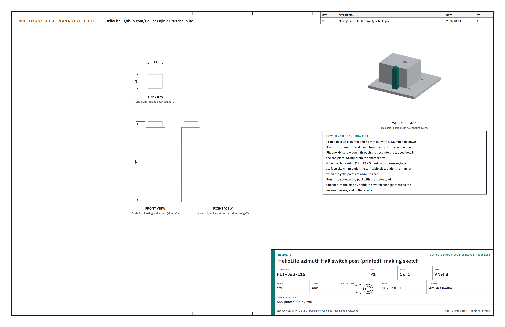

*Figure 21. Hall switch post making sketch (HLT-DWG-115).*

**What it is and what it is made from.** A printed post that holds the azimuth homing switch just under the turntable disc. ASA, 100 % infill.

**How to make it.** Print a 16 x 16 post 64 tall with a 4.5 hole down its centre, counterbored 8 from the top for the screw head.

**How it fits the parts next to it.** One M4 screw down through the post into the cap plate; the Hall switch glued on top, sensing face up, 4 under the disc's magnet when the yoke is at azimuth zero (Figure 23).

**Check before moving on.** Turning the disc by hand, the switch changes state as the magnet passes and nothing rubs.

### 3.16 Controller mounting plate

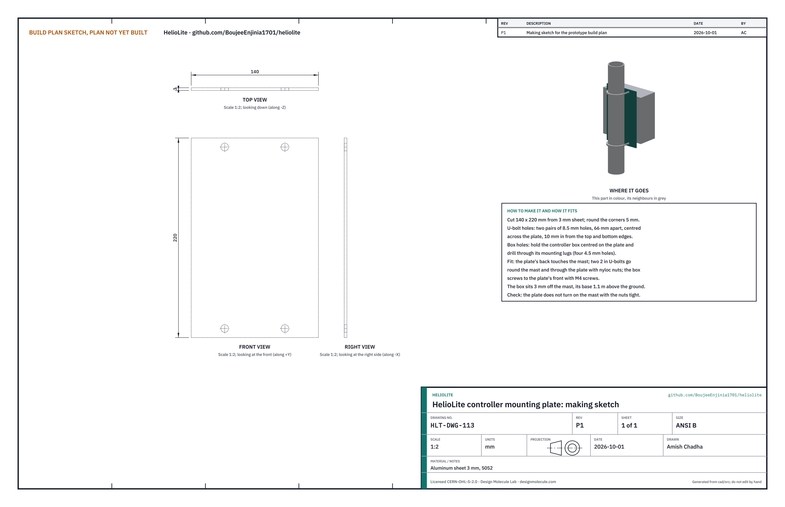

*Figure 22. Controller mounting plate making sketch (HLT-DWG-113).*

**What it is and what it is made from.** The plate that holds the controller box on the mast. Aluminum sheet 3 mm, 5052 class.

**How to make it.**

1. Cut 140 x 220 and round the corners 5.
2. Two pairs of 8.5 holes for the U-bolts, 66 apart, centred across the plate, 10 in from the top and bottom edges.
3. Hold the controller box centred on the plate and drill through its mounting lugs (four 4.5 holes).

**How it fits the parts next to it.** The plate's back touches the mast; two 2 in U-bolts go round the mast and through the plate with nyloc nuts; the box screws to the plate's front (Figure 25). The box base is 1.1 m above the ground.

**Check before moving on.** With the nuts tight, the plate does not turn on the mast.

### 3.17 Mast top: floor flange, shaft, hub and thrust washer (bought)

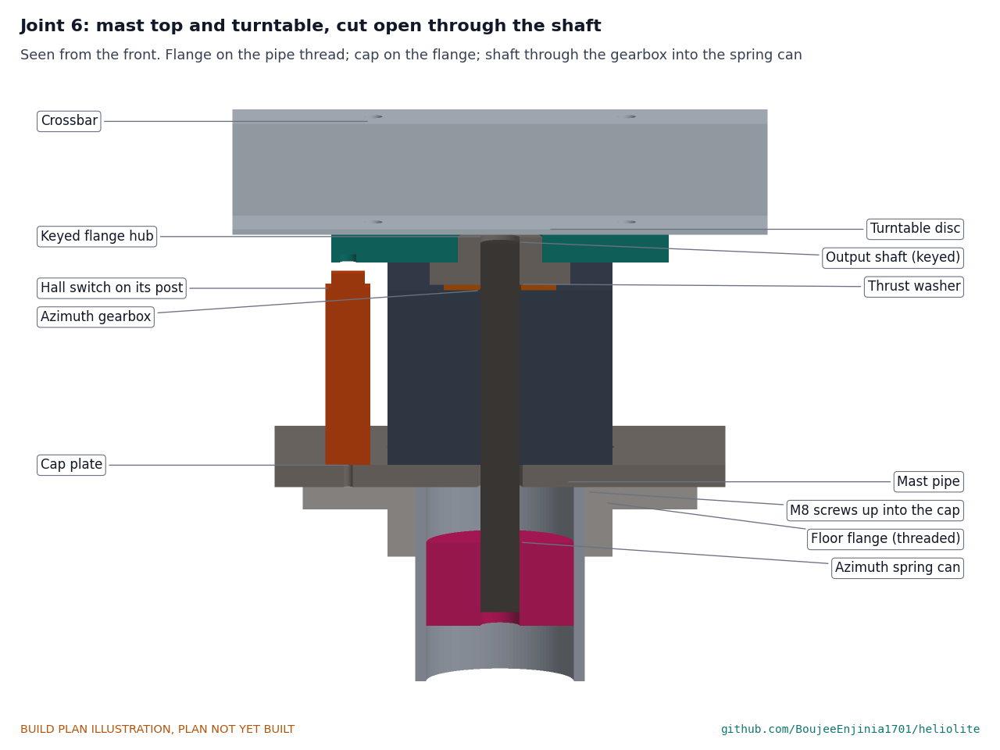

*Figure 23. Flange on the pipe thread; cap on the flange; shaft through the gearbox into the spring can; thrust washer, hub and disc on top.*

**What to buy.** A 2 in galvanized threaded floor flange and four M8 x 20 screws; the NMRV030 double output shaft (14 mm, keyed); a 14 mm keyed-bore aluminum flange hub about 50 diameter with a set screw and a 30 mm boss; a bronze thrust washer 15 x 40 x 2. **What to do to them.** The flange screws onto the pipe with thread sealant (step 13). The shaft goes through the azimuth gearbox's bore with its key and down through the cap into the spring can; the thrust washer sits on the gearbox's top face; the hub screws under the disc (step 9) and slides onto the shaft's key, its set screw tightened on the key (step 15).

### 3.18 Mast, ground anchor, controller and anemometer (bought)

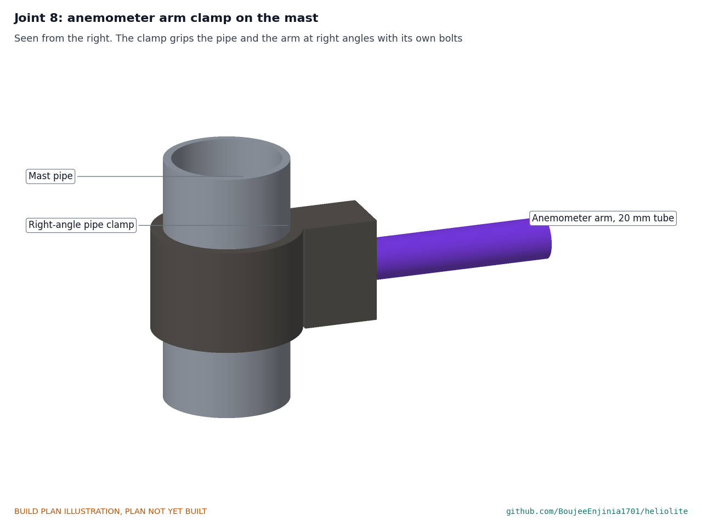

*Figure 24. The right-angle clamp grips the mast and the anemometer arm.*

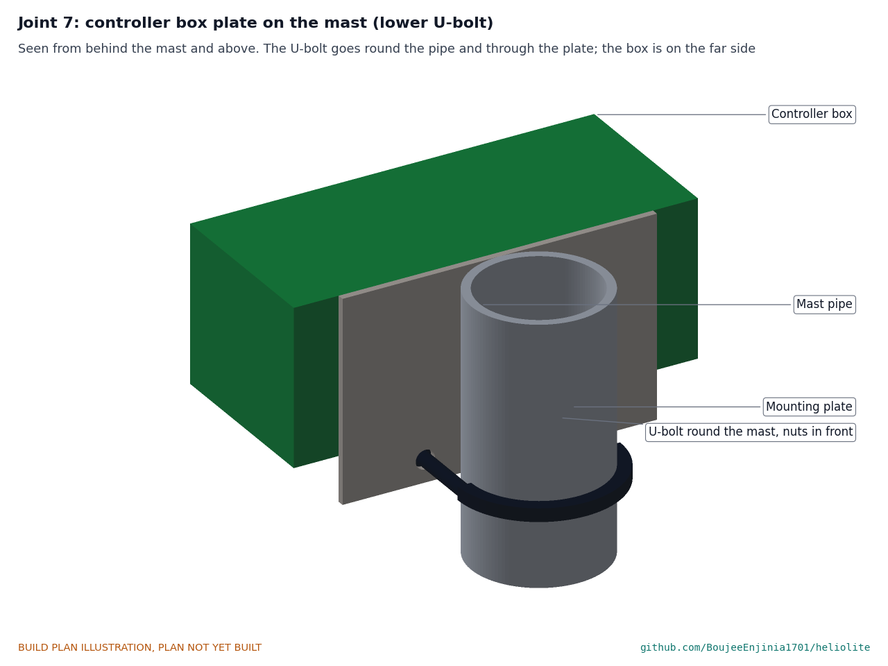

*Figure 25. Seen from behind the mast: the U-bolt goes round the pipe and through the plate; the box is on the far side.*

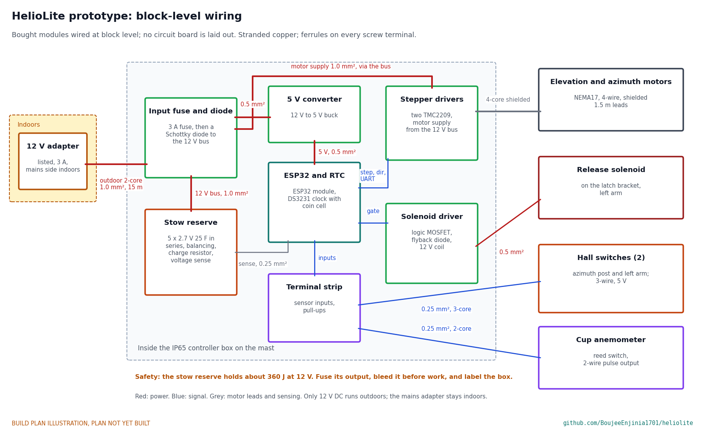

*Figure 26. Block-level wiring with wire sizes. No circuit board is laid out at this stage; bought modules stand in.*

**What to buy.**

- **Mast (BOM line 7).** 60.3 mm (2 in schedule 40) galvanized steel pipe, 3.9 mm wall, 1.70 m, threaded at the top end.
- **Ground anchor (line 8).** A ground screw for 60 mm posts, about 800 mm long, with a socket for 60.3 mm pipe and a head flange, rated for at least 1.0 kN·m overturning; two M10 set bolts. A concrete footing with a bolted flange is the alternative.
- **Controller (lines 9 and 15).** An IP65 box 180 x 80 x 180 with glands; ESP32 module; DS3231 clock with coin cell; two TMC2209 stepper drivers; 12 V to 5 V buck converter; five 2.7 V 25 F supercapacitors with balancing resistors, input diode, charge resistor and voltage sense; a 3 A fuse; a logic-level MOSFET and flyback diode for the solenoid; two 2 in U-bolts.
- **Anemometer (line 14).** A pulse-output cup anemometer (reed switch) on a 20 mm aluminum arm 550 long, and a right-angle pipe clamp for 60.3 mm to 20 mm.
- **Switches, solenoid and springs (lines 10, 16, 17).** Two unipolar Hall switches with potted leads and two 6 x 3 mm magnets; a 12 V pull solenoid with a return spring and about 12 mm stroke; two flat spiral springs of about 3 N·m.
- **Cabling and power (lines 11, 12).** Two 1.5 m shielded 4-core motor leads; 15 m of 2-core 1.0 mm² outdoor cable; cable glands, clips and ties; a listed 12 V, 3 A indoor plug-in adapter.
- **Fixings (line 13).** Stainless: M6 bolts with nyloc nuts and crush sleeves for the yoke; M6 countersunk screws for the gearboxes and latch; M8 x 20 screws for the flange; M5 and M4 screws; 5 x 24 mm roll pins; medium threadlocker; thread sealant; anti-seize.

**What to do to them.** Wire the controller as Figure 26, with stranded copper and a ferrule on every screw terminal. Keep the stow reserve's fuse out until the first power checks (section 6). The clamp holds the anemometer arm level at 1.5 m, pointing away from the house (Figure 24).

## 4. Putting it together

In each picture the parts already fitted are grey and the part being fitted is in colour, with an arrow showing the way it goes in. Steps 1 to 10 are bench work; steps 11 to 18 are at the site. The head goes on the mast in two lifts from a stable platform: first the yoke with its drive and latch (step 15), then the mirror assembly (step 16).

### Step 1: bond the ribs to the back of the panel

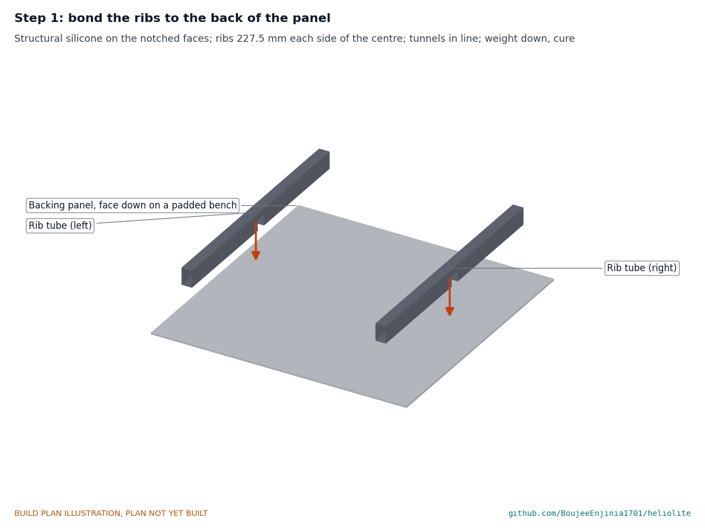

Panel face down on a padded bench. Structural silicone on each rib's notched face; ribs 227.5 each side of the centre line, ends 20 in from the edges, tunnels in line (check with a straight bar through both). Weight them down and let the silicone cure as its maker says.

### Step 2: slide the torque tube through the tunnels

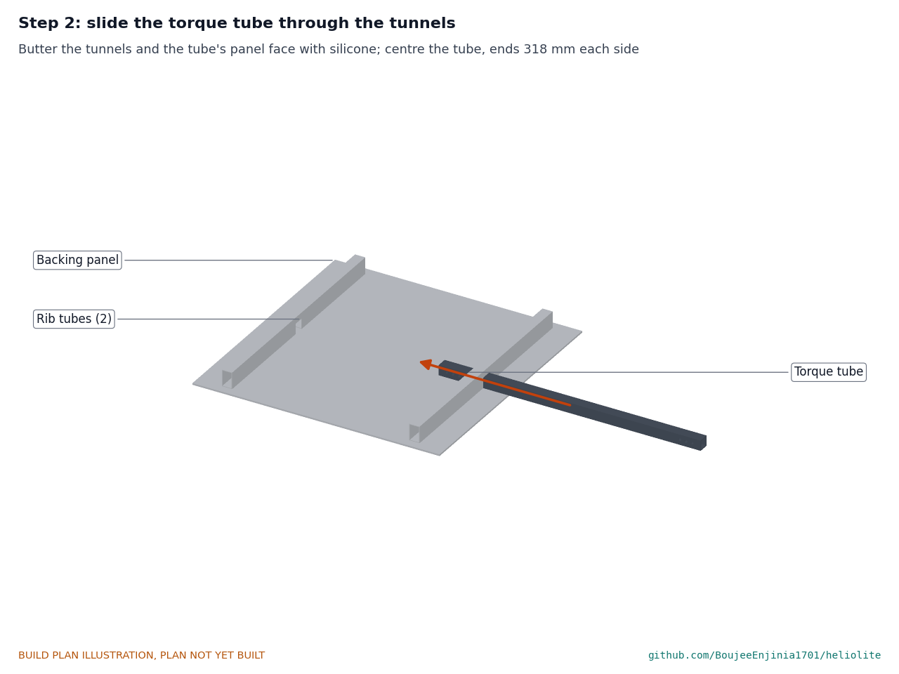

Butter the tunnels and the tube's panel face with silicone. Slide the tube through both tunnels, centred, its ends 318 each side of the centre. Wipe off the excess and let it cure.

### Step 3: end blocks into the tube ends

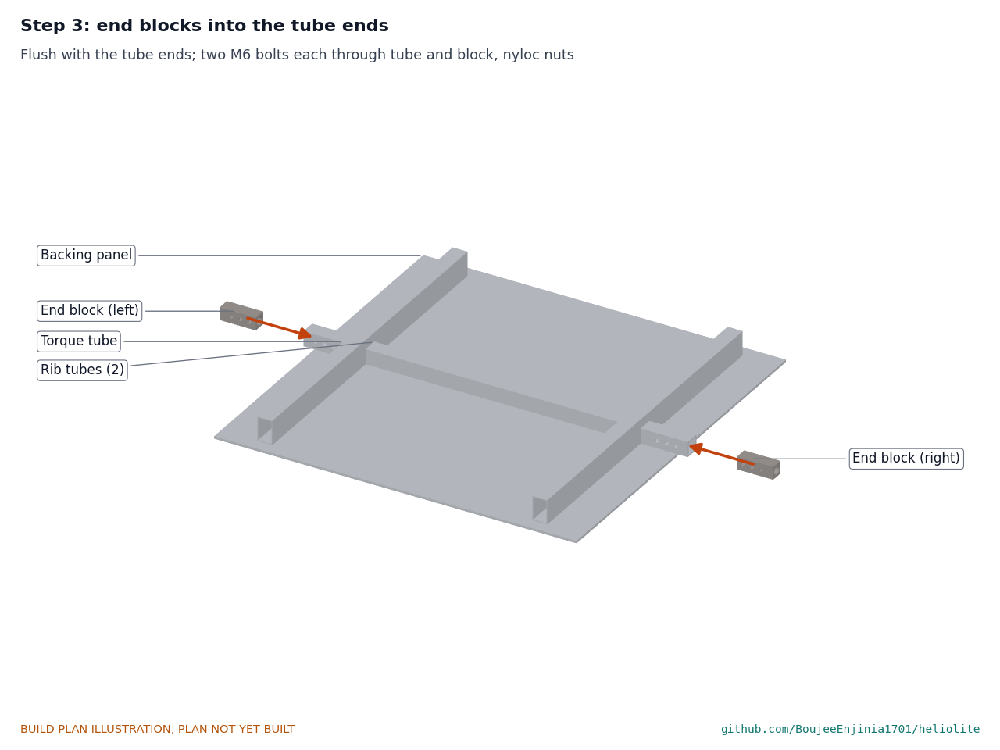

Slide a block into each end, flush. Two M6 bolts each through tube and block, nyloc nuts, snug.

### Step 4: stow lug onto the left end of the tube

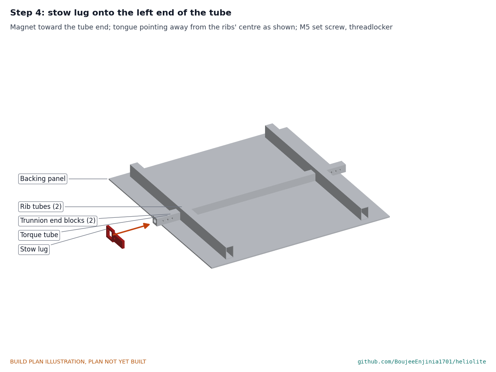

Slide the lug on, magnet toward the end, mid-plane 11 from the end. M5 set screw into the dimple with medium threadlocker.

### Step 5: bond the glass, then fit the edge channel

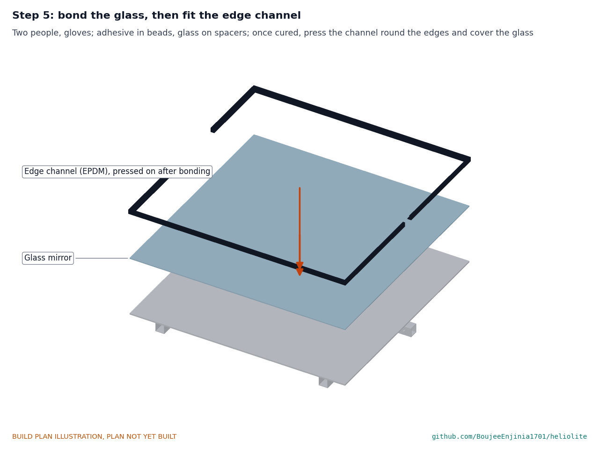

Turn the assembly face up on the padded bench. Two people, gloves and eye protection. Mirror adhesive in vertical beads on the panel, glass lowered onto spacers at the edges so it lies flat, not bowed. Once cured, press the black edge channel on round all four edges, lips over the glass front and the panel back, starting at a corner. Cut it back where the torque tube leaves the panel: 15 each side of the tube on the right edge, and 95 each side on the left (latch) edge, so the lug and latch pass. Then tape card over the glass and leave it there until calibration. **Hold point:** check the glass is flat with a straightedge in both directions; a bowed mirror concentrates sunlight.

### Step 6: arms and gussets onto the crossbar

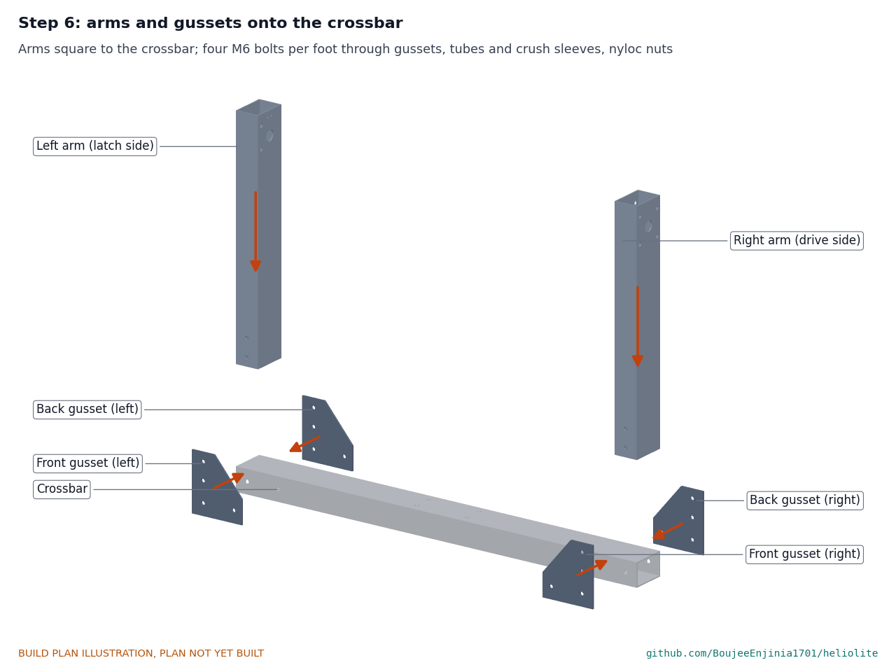

Stand each arm on a crossbar end, flush. A gusset on its front and back faces; four M6 bolts through gussets, tubes and crush sleeves, nyloc nuts. Square the arm to the crossbar before the last bolt is tight.

### Step 7: bearing plugs and bushes into the arms

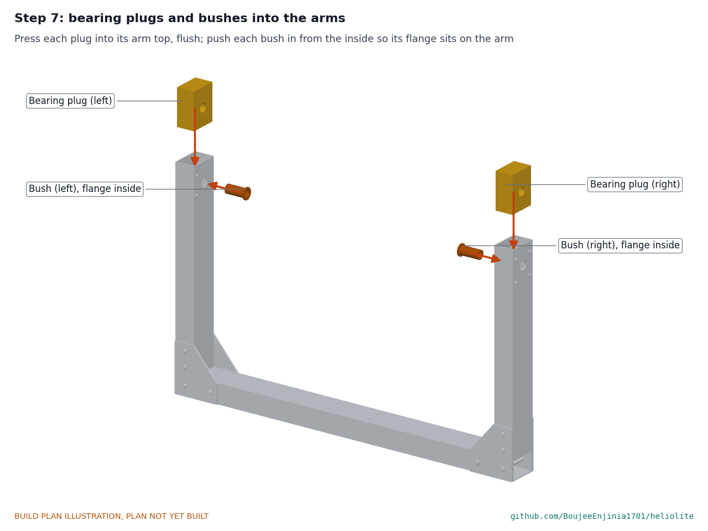

Press a plug into each arm top, flush, hole in line. Push each bush in from the inside, flange against the arm's inner side. Then drill the gearbox, latch and spring can holes through the plugs from the arms' holes.

### Step 8: latch, solenoid and Hall switch onto the left arm

Bracket flat on the left arm's inner side at the front, two M6 countersunk screws, nyloc nuts outside. Pawl into its slot, chamfer up. Solenoid strap screwed to the outside of the leg, plunger screwed into the pawl's tail. Hall switch in the window in the arm's inner side, its back glued to the bearing plug, sensing face toward the mirror; lead taken down the back of the arm.

### Step 9: turntable disc and hub under the crossbar

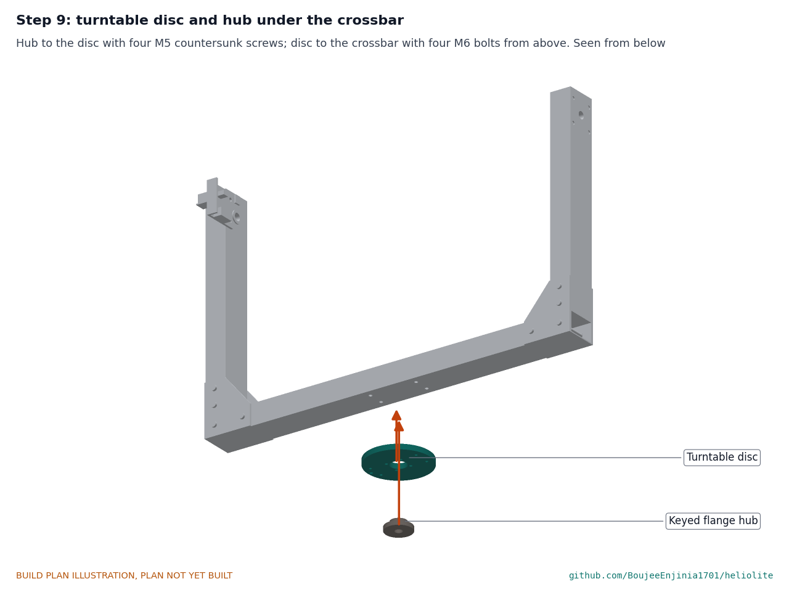

Hub to the disc's underside with four countersunk M5 screws, threadlocker. Disc to the crossbar with four M6 bolts from above, through the crush sleeves into the disc's tapped holes. The disc's magnet goes on the crossbar's centre line.

### Step 10: elevation drive onto the right arm

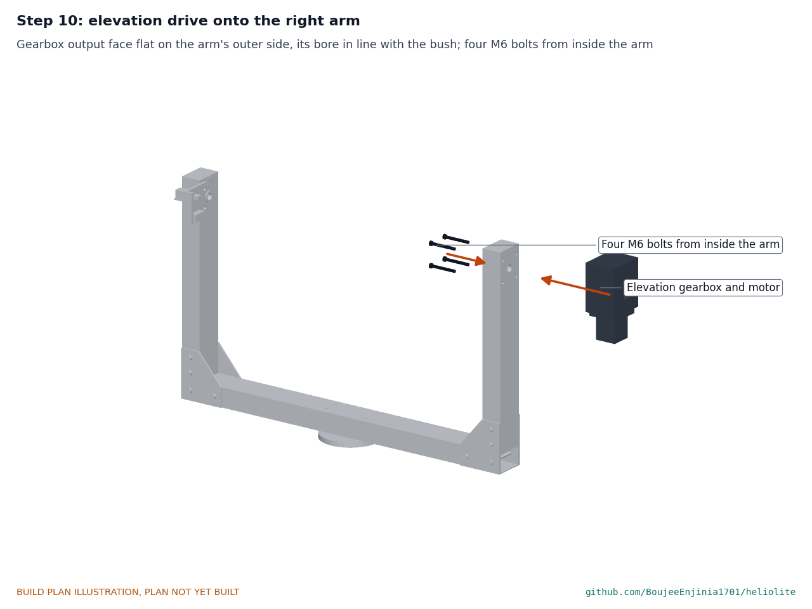

Gearbox output face flat on the right arm's outer side, its hollow bore in line with the bush; four M6 bolts from inside the arm, threadlocker. Motor and adapter plate on the gearbox's input. The yoke, its drive, latch, disc and hub now make the first lift, about 4.5 kg.

### Step 11: mast pipe into the ground anchor

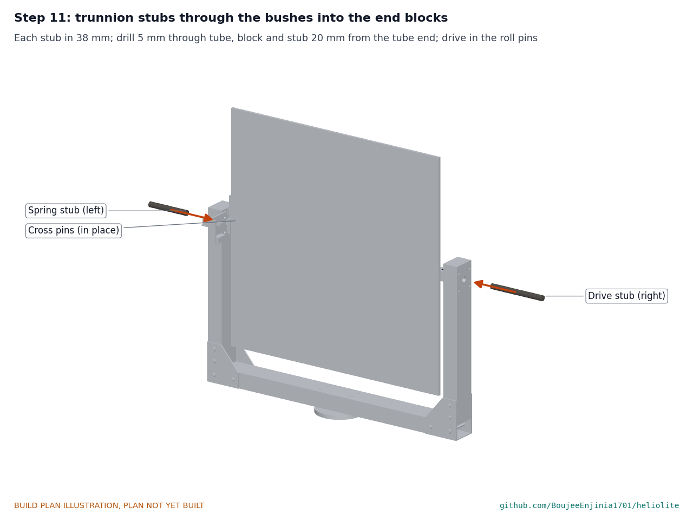

At the site, after checking for buried services, screw the anchor in plumb to the depth its maker gives. Lower the pipe into the socket to the socket's floor, plumb it with a level on two faces, and tighten the two M10 set bolts.

### Step 12: controller box and anemometer onto the mast

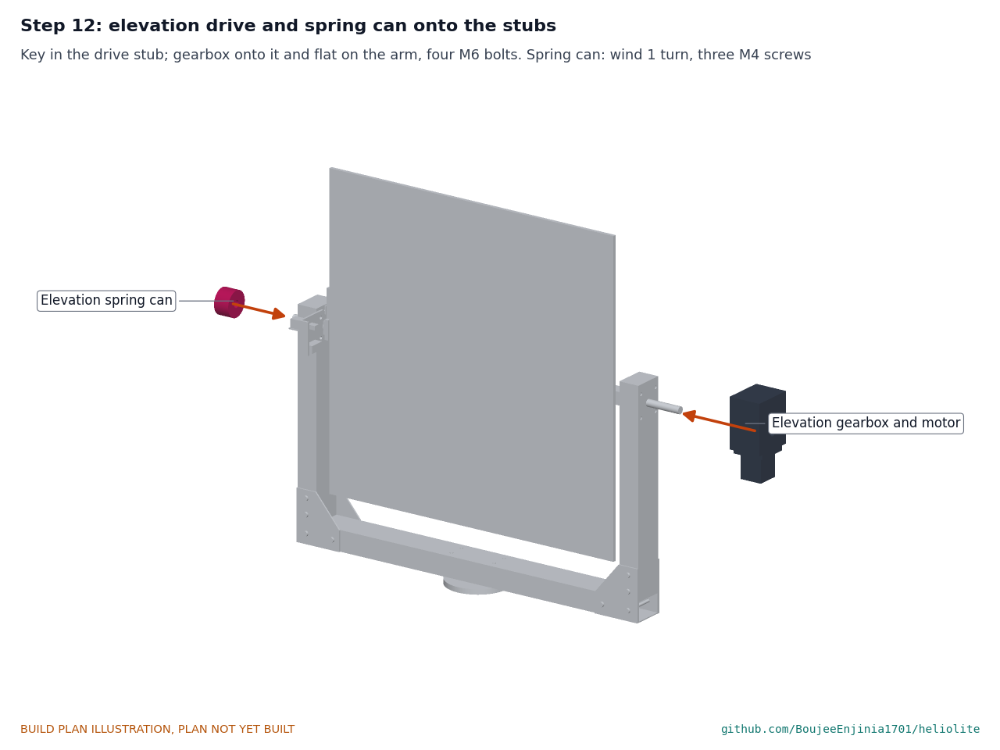

Controller box screwed to its plate; plate on the mast with two U-bolts, box base 1.1 m up, facing where you will service it. Anemometer clamp at 1.5 m, arm level, pointing away from the house.

### Step 13: floor flange onto the mast top

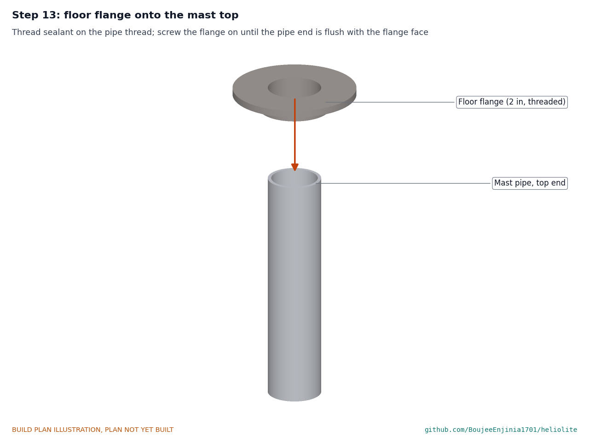

Thread sealant on the pipe thread. Screw the flange on with a pipe wrench until the pipe end is flush with the flange face.

### Step 14: cap and azimuth drive onto the floor flange

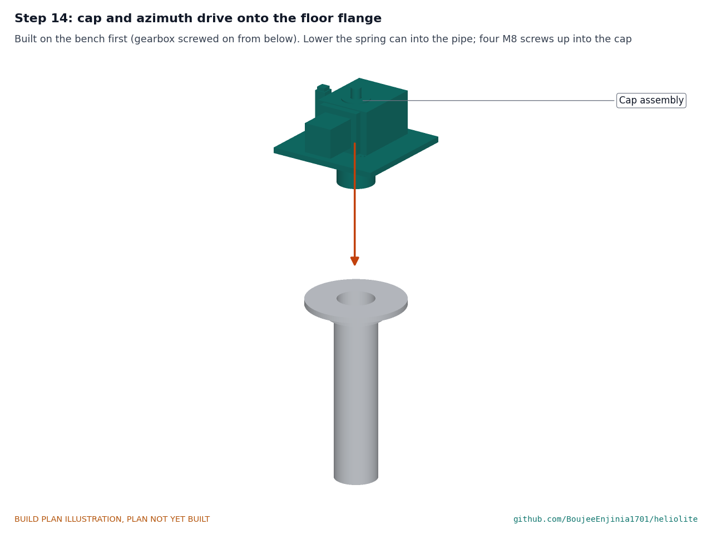

On the bench first, build the cap assembly: gearbox and motor to the cap with four countersunk M6 screws from below; shaft through the gearbox with its key; Hall post and switch on the cap; spring on the shaft's lower end in its can, wound 1 turn; thrust washer on the gearbox's top face. At the mast, lower the spring can into the pipe and seat the cap on the flange, motor away from the controller side as the picture shows. Four M8 screws up through the flange into the cap; one M5 screw through the pipe wall into the spring can.

### Step 15: first lift, the yoke and drive onto the azimuth shaft

Two people, working from a stable platform with the deck about 1 m below the cap. Lift the yoke with its elevation drive, latch, disc and hub (about 4.5 kg) and lower it so the hub's keyway slides down the shaft's key until the hub sits on the thrust washer; tighten the hub's set screw on the key. Turn the yoke so the latch side faces the platform. **Hold point:** safety stop S6 in section 6.

### Step 16: second lift, lower the mirror assembly into the yoke

Lay two timber packers 54 tall on the crossbar, about 150 each side of the centre. Two people on the platform, gloves on, glass covered. Hold the mirror assembly (about 6.3 kg) upright, glass to the front and the lug at the top of the left end, and lower it between the arms until its bottom edge rests on the packers: the tube ends then sit between the bush flanges, in line with the bushes. The tube is 1 mm shorter than the gap between the flanges and passes the Hall switch with 1 mm to spare.

### Step 17: trunnion stubs, cross pins and spring can

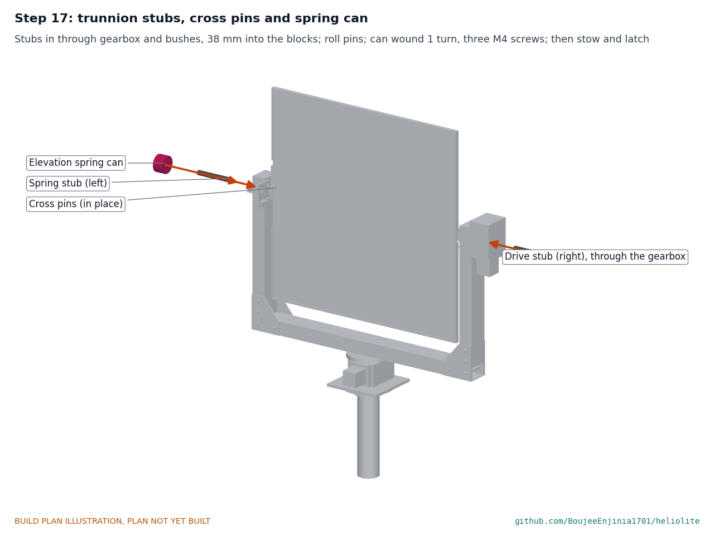

Slide the drive stub in from outside through the gearbox's bore and the right bush, key engaged, 38 into the end block; slide the slotted spring stub through the left bush 38 into its block. Drill 5 mm through tube, block and stub 20 from each tube end and drive in the roll pins. Lift the mirror off the packers and remove them. On the left, fit the spring's inner end in the stub's slot, wind the can 1 turn so the spring pulls the mirror toward stow, and screw the can to the arm with three M4 screws. Turn the mirror slowly into stow by hand until the lug pushes the pawl aside and lands on the pad. **Hold point:** the mirror turns freely by hand through its whole range with no rub at either bush, and it latches face-down; the spring now holds stored energy, so keep fingers out of the mirror, tube and yoke gaps from here on.

### Step 18: cabling and the service loop

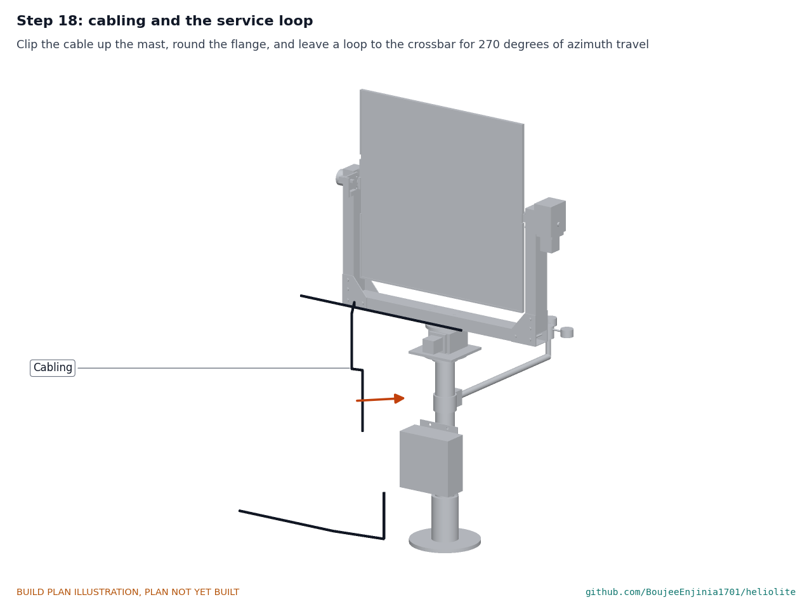

Run the motor leads, Hall switch leads, solenoid lead and anemometer lead to the controller box through its glands. Clip the riser to the mast with stand-off clips, step it out round the floor flange and cap, and leave a loop from beside the azimuth motor to the crossbar long enough for the yoke to turn 135 degrees each way without pulling. Tie the leads along the crossbar's top and up the back of each arm. Run the outdoor 12 V cable from the box to the house, low and clipped.

## 5. First checks

These are the checks a TRL 4 test report would record; this plan only lists them. Requirement numbers are those of HLT-REQ-001.

*Table 2. First checks.*

| Check | Requirement | How | Pass when |
| --- | --- | --- | --- |
| Mirror flat | Safety, R1 | Straightedge across the glass both ways and diagonally, before covering it | No gap over 0.5 mm |
| Elevation range | R8 | Drives off, turn the mirror by hand from face-down to face-up | No rub anywhere; the lug clears the bracket, pad and switch at every angle |
| Latch engages unpowered | R9, R10 | Turn the mirror into stow by hand | The lug pushes the pawl aside, lands on the pad and the pawl springs out over it |
| Latch holds | R9 | Push the stowed mirror's edge up by hand | The lug stays between pad and pawl |
| Latch releases | R10 | 12 V to the solenoid through its driver | The pawl pulls back fully; the mirror can leave stow |
| Azimuth range | R8 | Drives off, turn the yoke by hand 135 degrees each way | The service loop does not pull; nothing rubs |
| Homing switches | R5 | Meter on each switch output while turning each axis through home | Each switch changes state once, at home |
| Preload | R4 | Push the mirror and yoke gently against the springs | Each returns to the same side of its backlash |
| Stow on stored energy | R10 | Charge the reserve, remove the 12 V feed with the mirror at 45 degrees | The mirror reaches face-down and latches within 60 s |
| Standby power | R14 | Meter in the 12 V feed for 1 h | 3 W average or less |
| Mast plumb and tight | R13, safety | Level on two faces; set bolts and flange screws checked | Within 1 degree; nothing moves by hand |
| Mass on the mast top | R13 | Weigh the yoke with its drive and the mirror assembly before each lift | 13 kg or less together (12.99 kg estimated: 4.5 kg and 6.3 kg) |

## 6. Safety stops

Stop at each point. Carry on only when everything listed is true.

- **S1. Before handling the glass (step 5).** Two people; cut-resistant gloves and eye protection; a padded bench; the edges seamed; the backing film intact.
- **S2. Once the glass is bonded.** Card taped over the glass, and kept there through every step until calibration. An uncovered mirror can put a beam nearly as bright as the sun on a person, a road or an aircraft.
- **S3. Before the springs are wound (steps 14 and 17).** Drives disconnected; hands out of the gaps between mirror, tube and yoke (20 to 56 mm) and between the lug and the latch bracket. A wound spring turns its axis if the drive is disconnected.
- **S4. Before the stow reserve is charged.** Its output fuse fitted, its bleed resistor fitted, the box labelled. Bleed it before any work in the box.
- **S5. Before power reaches the drives.** The 12 V feed comes from the listed indoor adapter only; no mains outdoors. The mirror is latched face-down and covered; the motor leads are checked for polarity at the drivers.
- **S6. Before each lift onto the mast (steps 15 and 16).** The mast is plumb and its set bolts tight; the cap screws tight; two people working from a stable platform, never from steps or a ladder alone; the yoke and drive fitted first and the mirror assembly lowered into it; no wind above a gentle breeze; the glass covered.
- **S7. Before the mirror is uncovered (outside this plan).** The local building and planning rules are checked and a simple glare study shows the beam stays inside the property in every state; the site check of HLT-PRC-001 is done: the beam path crosses no path, road, neighbour's window or flight approach; calibration is done standing beside, never in, the beam.
- **S8. Before a storm.** Until the latch is tested at TRL 4, remove the mirror if gusts above about 29 m/s are forecast.

## 7. Tools, skills and workspace

**Tools.** Hacksaw with a 24 teeth per inch blade (or a bandsaw); bench vice with soft jaws; drill press; drills 2.5 to 16 mm; step drill to 20 mm; 14 and 18 mm hand reamers; countersink; M3, M4, M5, M6 and M8 taps and tap drills; jigsaw with a metal blade; flat and square files; deburring tool; scriber, engineer's square, steel rule and calipers; caulking gun for silicone; 3D printer with an enclosure that prints ASA, bed at least 100 x 100; pipe wrench; spirit level; torque wrench covering 5 to 25 N·m; soldering iron; ferrule crimper and wire strippers; multimeter; bench power supply (0 to 15 V, 0 to 3 A, adjustable current limit); bathroom or hanging scale to 20 kg; a stable work platform with guard rails and its deck about 1 m below the mast top; two timber packers 54 mm tall.

**Skills.** No certified trade is needed. Basic metalwork (marking out, sawing, drilling, reaming, tapping, filing), bonding with silicone, printing ASA, crimping and screw-terminal wiring, safe handling of glass and of supercapacitors. All outdoor circuits are extra-low voltage (12 V DC); the mains adapter is a listed product used indoors and no mains wiring is part of this build.

**Workspace.** A bench about 2 x 1 m with a padded top for the mirror; a metalwork corner kept apart from the electronics; a ventilated place for the printer; at the site, clear ground round the mast and a sunny day only once the mirror is uncovered.

**Personal protective equipment.** Safety glasses for cutting, drilling and soldering; cut-resistant gloves for glass and sheet; hearing protection when sawing; no gloves near a turning drill; dark glasses rated for sun viewing are not a substitute for keeping out of the beam.

## 8. Where the numbers come from

- Model and constructability checks: `cad/src/model.py` (`python cad/src/model.py --check`, 3,634 checks, including lowering the mirror assembly into the yoke at height); STEP and STL exports in `cad/step/` and `cad/stl/`.
- Pictures: `cad/src/build_plan_media.py`, using `.kit/build_views.py`; written to `docs/05-build-plan/` and `cad/drawings/HLT-DWG-101` to `HLT-DWG-115`.
- General arrangement: `cad/drawings/HLT-DWG-001.pdf`, Rev P5.
- Calculations: `docs/04-calcs/01-sizing.md` (HLT-CAL-001 v0.5) and `docs/04-calcs/sizing.py`; mass and the two lifts [H1] to [H3], balance [H4], arm stiffness [C4], pointing [D5], latch [E7] to [E9], cost [J1].
- Bill of materials: `bom/bom.csv`.
- Decisions: `docs/decisions/0003-design-for-construction.md` (HLT-DDR-003), with HLT-DDR-001 and HLT-DDR-002; open items in `docs/06-design-decisions.md` (HLT-DEC-001).
- Requirements: `docs/03-requirements.md` (HLT-REQ-001 v0.8).
